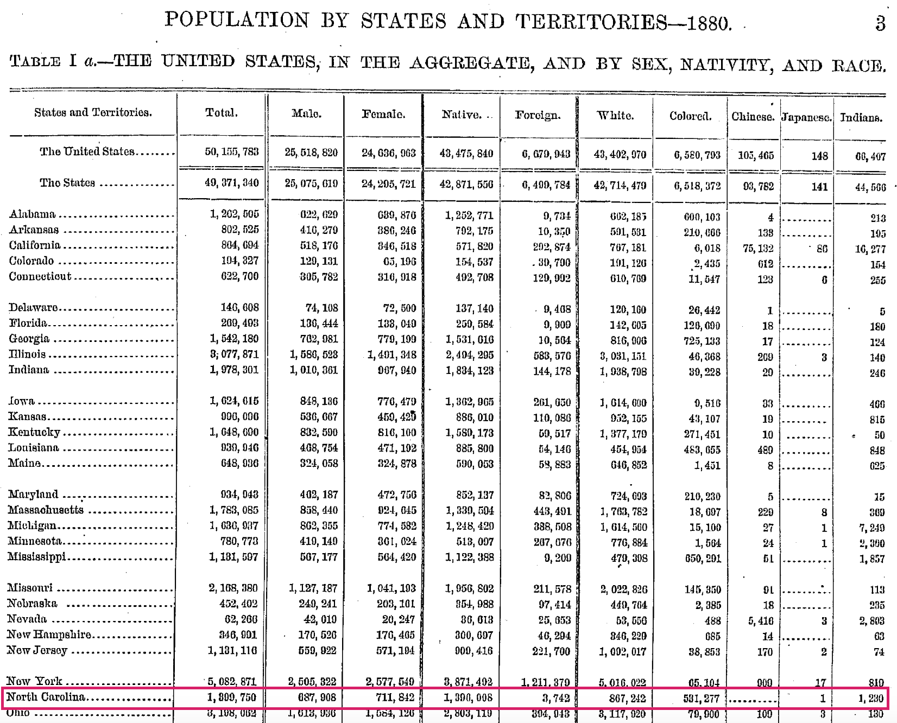

This R notebook accompanies the [Session 4.1 application activity](http://www.designsandmethods.com/modules/mod4/s4-1/) for [Global Health Research: Designs and Methods](http://www.designsandmethods.com/). To get started, click the "Code" button in the top right corner of the screen and download the `Rmd` file. You have two options for running this file:

1. If you downloaded and installed R and RStudio, you can open this file with RStudio.
2. The easier option is to login to your 'virtual' RStudio environment on Duke's server. Go [here](https://vm-manage.oit.duke.edu/), enter your credentials, and follow the `Docker` link to the option to launch RStudio. Once RStudio is running in your browser, go to the `Files` tab and `Upload` the `Rmd` file. Open it.

## Setup

This first code chunk will check to make sure you have all of the required packages. 

```{r, message=FALSE}
  list.of.packages <- c("data.table", "httr")
  new.packages <- list.of.packages[!(list.of.packages %in% 
                                     installed.packages()[,"Package"])]
  if(length(new.packages)) install.packages(new.packages)
  library(data.table)
  library(httr)
```

## Import

Let's start by importing the data. 

```{r, results='hide'}
  response <- GET("https://www.dropbox.com/s/wvm6ykkomwjj37o/1880nc.csv.zip?dl=1",
                  write_disk("1880nc.csv.zip"),
                  progress())
  f <- unzip("1880nc.csv.zip")
  dat <- fread(f[1])
```

If this chunk ran successfully, you will have a dataframe called `dat` in your `Environment` tab.

## Examine the data

Examine the data by running head(dat). This will show you the first 6 rows of the dataset. The first several variables are household-level variables, so the values are the same for every member of the household. Starting with gender, the remaining variables are measured for each individual in the household.

```{r}
head(dat)
```

The definitions of key variables are shown in the table below. See this enumeration form to understand what citizens were asked back in 1880. These instructions indicate how enumerators were trained to gather this information.

| Variable | Definition |
|:---------|:-----------|
| serial   | a unique identifier for households |
| numperhh | the number of people residing in each household |
| region   | census region |
| statefip | state |
| urban    | urban or rural classification |
| farm     | farm household |
| sex      | gender of person |
| age      | age of person |
| marst    | marital status |
| race     | race |
| nativity | birthplace of self and parents |
| labforce | labor force status |

There are 1,401,478 observations in the dataset, but the official tabulation comes in slightly below this at 1,399,750. Rather than dig through the notes to determine the source of the discrepancy, we'll go with the data file.



## Sampling Error

The first thing we want to do is determine the proportion of single, never married individuals in the population. Note this on your AA sheet.

```{r, results='hide'}
  N <- nrow(dat)
  table(dat$marst)
  singleCt <- table(dat$marst)[names(table(dat$marst))=="Never married/single"]
  singleP <- singleCt/N
  singleP
```

Next, we can begin drawing random samples. Use the following code to draw two random samples of 100 observations each and calculate the proportion of single, never married women in each sample. Record the results on your AA sheet. What is the lesson about sampling to draw from this?

```{r, results='hide'}
# sample
  n <- 100
# 100 (a)  
  set.seed(1)
  s100a <- dat[sample(1:nrow(dat), n, replace=FALSE),]
  singleCt100a <- table(s100a$marst)[names(table(s100a$marst))=="Never married/single"]
  singleP100a <- singleCt100a/n
  singleP100a
# 100 (b)
  set.seed(2)
  s100b <- dat[sample(1:nrow(dat), n, replace=FALSE),]
  singleCt100b <- table(s100b$marst)[names(table(s100b$marst))=="Never married/single"]
  singleP100b <- singleCt100b/n
  singleP100b
```

Now let's draw 10,000 samples. Run the code in the block below and write down your prediction about the shape and center of the distribution of all 10,000 sample proportions. Once you guess, then run `hist(singleSamples)` and check your prediction.

```{r, results='hide'}
# 10000 samples
  n <- 100
  singleSamples <- NULL
  for (i in 1:10000) {
    # set new seed
    set.seed(i)
    s <- dat[sample(1:nrow(dat), n, replace=FALSE),]
    singleCt <- table(s$marst)[names(table(s$marst))=="Never married/single"]
    singleP <- singleCt/n
    singleSamples <- c(singleSamples, singleP)
  }
```

Finally, let's examine what happens to sampling error as the sample size increases. The formula for the standard error of a proportion is:

$$
sqrt(p(1-p)/N)
$$
Run the following code and record the results in your Google Doc (mean proportion, standard error, margin of error, 95% confidence interval, width of confidence interval). Then change `n <- 100` to `n <- 1000`, run the code again, and note your results. What changed and why? Change the code a final time to `n <- 10000` and note the results.

```{r, results='hide'}
# error
  n <- 100
# create sample
  set.seed(1)
  s <- dat[sample(1:nrow(dat), n, replace=FALSE),]
  singleCt <- table(s$marst)[names(table(s$marst))=="Never married/single"]
  singleP <- singleCt/n
  singleP
# standard error and 95% confidence intervals
  se <- sqrt((singleP*(1-singleP))/n)         # standard error
  se
  me95CI <- 1.96*se                           # margin of error
  me95CI
  CI95l <- singleP - me95CI                   # lower 95% CI
  CI95l 
  CI95u <- singleP + me95CI                   # upper 95% CI
  CI95u
  widthCI <- CI95u - CI95l                    # width of CI
  widthCI
```