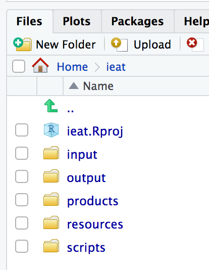

## {data-background="w01-cover.jpg"}

<style type="text/css">
p { text-align: left; }
</style>

## Objectives 

By the end of this session, you should be able to:

* State the benefits of a reproducible analysis
* Login to your RStudio instance and explain the layout
* Illustrate the use of the Markdown language
* Explain how to seek help and create a reproducible example

## <span style="color:red">Reproducibility</span> {data-background-image="https://media.giphy.com/media/j8sVwJid3NdjG/giphy.gif"}

## Workflows

## {data-background-iframe="https://kieranhealy.org/resources/"} 

## {data-background-iframe="http://socviz.co/index.html"} 

## Simplified Model 

<center>

</center>

## Tools

* **RStudio**: provides a nicer interface for using R and an authoring framework for data science
* **LaTeX**: helps behind the scenes to knit to PDF and offers more control over typesetting
* **Zotero, BibDesk, and .bib files**: manage references 

## {data-background-iframe="http://rmarkdown.rstudio.com/"}

## {data-background-iframe="https://player.vimeo.com/video/178485416?color=428bca&title=0&byline=0&portrait=0"}

## Using Duke's Docker-ized version of RStudio Server

In this workshop, we will use RStudio via the web. 

* Login to your instance by going to [https://vm-manage.oit.duke.edu/containers](https://vm-manage.oit.duke.edu/containers) and entering your NetID. 
* Click on Docker
* Click on RStudio

## RStudio Interface

<center>

</center>

## RStudio Interface

<center>

</center>

## Projects

Never hardcode a working directory again!

* Click on Projects
* Choose to create a new project
* Follow the prompt to create a new directory called "ieat"

<center>

</center>

## Organization

<center>

</center>

## Organization

<center>

</center>

## New files

<center>

</center>

## R script

Create a new R script file

* similar to Stata's do file
* not interactive
* output appears in console and plot window

<center>

</center>

## RMarkdown

Create a new RMarkdown HTML file

<center>

</center>

## Markdown language

```{r, eval=FALSE}
Plain text, *italics*, **bold**, `monospaced font`

~~strikethrough~~, sub/superscript^2^~2~, endash: --, emdash: ---
  
equation: $A = \pi*r^{2}$
  
$$E = mc^{2}$$
  
> block quote 
  
list:
  
  * item 1
  * item 2
  * item 3
```

## Markdown Language

Plain text, *italics*, **bold**, `monospaced font`

~~strikethrough~~, sub/superscript^2^~2~, endash: --, emdash: ---
  
equation: $A = \pi*r^{2}$
  
$$E = mc^{2}$$
  
> block quote 
  
list:
  
  * item 1
  * item 2
  * item 3

## Getting help

* Google
* Read the documentation
* Stack Overflow
* Github issues / listserves for specific packages
* New: [https://community.rstudio.com/](https://community.rstudio.com/)

## An unexpected result!

```{r}
x <- c(4, 2, 6, 9, 2, 5, 4, 3, 7, 6, 8, 4, 7, 2, NA, 3)
x_mean <- mean(x)
x_mean
```

## ?function

`?mean`

<center>

</center>

## Stack Overflow

<center>

</center>

## Bad questions

<center>

</center>

## Reproducible Example

<center>

</center>
