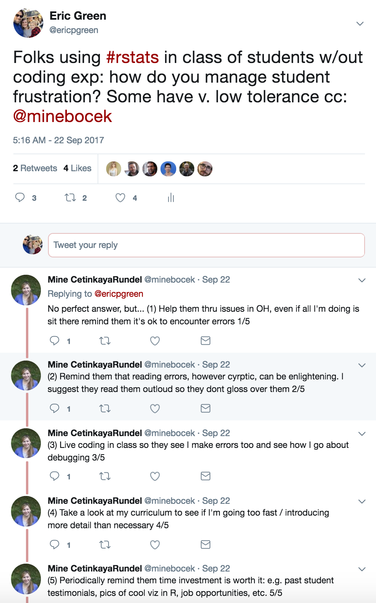
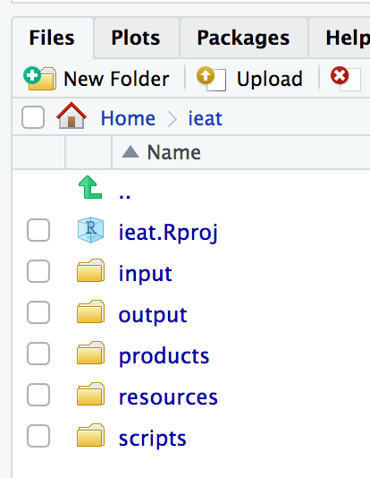
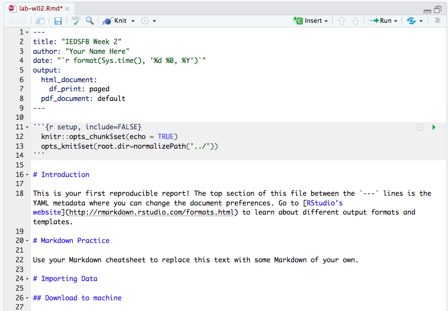

## {data-background="w02-cover.jpg"}

<style type="text/css">
p { text-align: left; }
</style>

## Objectives 

By the end of this session, you should be able to:

* Load data into R from multiple sources
* Write Rmarkdown syntax and knit an Rmarkdown file
* Enjoy the tfw your code is commented and readable

## <span style="color:red">Low frustration tolerance?</span> {data-background-image="https://media.giphy.com/media/kHU8W94VS329y/giphy.gif"}

## Remember this

> R does exactlly what you tell it to do, rather than what you want it to do
<br>
-Kieren Healy

* No one writes error-free code the first time
* De-bugging and testing are part of the process
* Each error you make teaches you something about how R works

## Take some tips from the pros

<center>

</center>

## Common mistakes

* Unbalanced (parentheses
* Completing expressions (+ vs. > in the command line)
* Code that wraps across lines (+)
* Spelling!

## {data-background-image="https://media.giphy.com/media/zaezT79s3Ng7C/giphy.gif"}

## Login to Duke's Docker-ized version of RStudio Server

* Login to your instance by going to [https://vm-manage.oit.duke.edu/containers](https://vm-manage.oit.duke.edu/containers) and entering your NetID. 
* Click on Docker
* Click on RStudio
* When RStudio loads, restart the R session (`Ctrl/Cmd+Shift+F10`), clear the console (`Ctrl/Cmd+L`), and clear your workspace 

## Open your project

Last week you created a project for this workshop. Is this project still open? If not, click on the project icon to load it. (Don't create a new one.)

<center>

</center>

## Working directory

In your console run:

```{r, eval=FALSE}
getwd()
```

If you successfully created a project and have this project open, the working directory should be your project directory

## Relative file paths

Every file reference should be relative to this working (root) directory. 

* `../` goes up one level
* `../../` goes up two levels
* `subdirectory/` does down one level
* `subdirectory/subsubdirectory/` goes down two levels

## Find your directories

Identify where you want to save today's template file (e.g., products).

<center>

</center>

## Download the template

Change `products` to your preferred subfolder.

```{r, eval=FALSE}
  download.file("https://raw.githubusercontent.com/
                ericpgreen/IEatDataScience/master/labs/lab-w02.Rmd", 
                destfile = "products/lab-w02.Rmd")
```

## Open template file

<center>

</center>

## A tricky thing

When you knit a document, RStudio thinks that the directory where the document is saved should be the working directory. If your template is stored in `root/products`, for instance, `products` will become the working directory and relative file paths won't work. To fix this, we added the following to the first R code chunk: 

```{r, eval=FALSE}
opts_knit$set(root.dir=normalizePath('../'))
```

This says, "Yo Knitr, the working directory is one level up from this file."

## Write some Markdown text

Turn to the back of your Markdown cheatsheet and try writing some text under the "Markdown Practice" heading (e.g., bold, italics, lists, subheadings, web links, footnote). Then click "Knit" to compile the document. 

## Let's import some data

* csv
* Excel
* Google Sheets
* Stata
* APIs

## Download data
 
The data files we want to import are sitting on Dropbox. We could import directly into the R session, but let's first download the files to your project directory and then load into R. The loading step will teach you how read in files from your local machine. 

* Replace `input` with the name of the folder where you want to store raw data.
* Run this code chunk once. Once you run it successfully, replace `{r}` with `{r, eval=FALSE}` to prevent R from trying to download the files over and over again.

```{r, eval=FALSE}
  download.file("https://www.dropbox.com/s/k4d2j6feayezkun/r2d2.csv?dl=1", 
                destfile = "input/r2d2-w02.csv")
  download.file("https://www.dropbox.com/s/1e2tqqmfzmzaybe/r2d2.dta?dl=1", 
                destfile = "input/r2d2-w02.dta")
  download.file("https://www.dropbox.com/s/6b8t2c877yvqeax/r2d2.rds?dl=1", 
                destfile = "input/r2d2-w02.rds")
  download.file("https://www.dropbox.com/s/beftqecfs4vvuss/r2d2.sas?dl=1", 
                destfile = "input/r2d2-w02.sas")
  download.file("https://www.dropbox.com/s/tiqgit23db2fk8x/r2d2.txt?dl=1", 
                destfile = "input/r2d2-w02.text")
  download.file("https://www.dropbox.com/s/7a3i7e0bfmqiikr/r2d2.xlsx?dl=1", 
                destfile = "input/r2d2-w02.xlsx")
```

## CSV

A csv file is an ideal format for sharing data. Simple. Lightweight. Readable by any program. Import with the `read.csv()` function. Start by running `?read.csv` in the console to view the help file.

<center>

</center>

## ? Help File

`?read.csv`: What arguments are required?

<center>

</center>

## CSV

Now import the csv file:

```{r, eval=FALSE}
datCSV <- read.csv("input/r2d2-w02.csv", stringsAsFactors = FALSE)
```

This will create an object called `datCSV`.