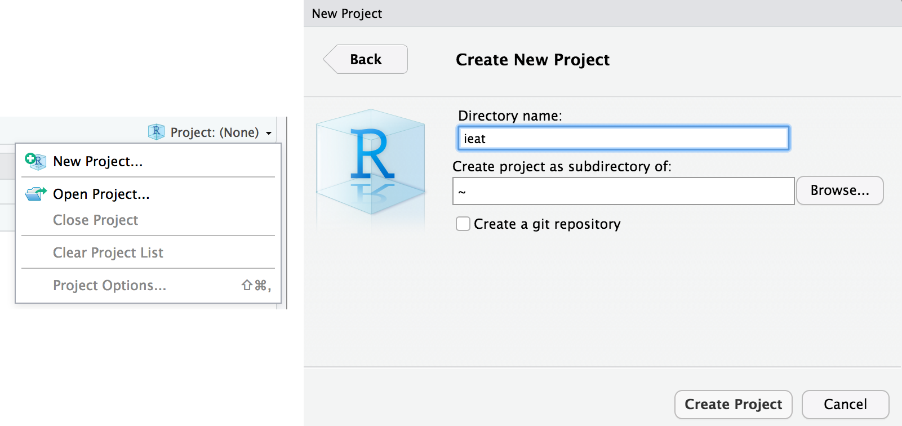

## {data-background="w02-cover.jpg"}

<style type="text/css">
p { text-align: left; }
</style>

## Objectives 

By the end of this session, you should be able to:

* Load data into R from multiple sources
* Write tidy code to inspect and clean your data
* Enjoy the tfw your code is commented and readable

## <span style="color:red">Low frustration tolerance?</span> {data-background-image="https://media.giphy.com/media/kHU8W94VS329y/giphy.gif"}

## Remember this

> R does exactlly what you tell it to do, rather than what you want it to do
<br>
-Kieren Healy

* No one writes error-free code the first time
* De-bugging and testing are part of the process
* Each error you make teaches you something about how R works

## Take some tips from the pros

<center>

</center>

## Common mistakes

* Unbalanced (parentheses
* Completing expressions (+ vs. > in the command line)
* Code that wraps across lines (+)
* Spelling!

## {data-background-image="https://media.giphy.com/media/zaezT79s3Ng7C/giphy.gif"}

## Login to Duke's Docker-ized version of RStudio Server

* Login to your instance by going to [https://vm-manage.oit.duke.edu/containers](https://vm-manage.oit.duke.edu/containers) and entering your NetID. 
* Click on Docker
* Click on RStudio
* When RStudio loads, restart the R session (`Ctrl/Cmd+Shift+F10`), clear the console (`Ctrl/Cmd+L`), and clear your workspace 

## Open your project

Last week you created a project for this workshop. Is this project still open? If not, click on the project icon to load it. (Don't create a new one.)

<center>

</center>

## Working directory

In your console run:

```{r, eval=FALSE}
getwd()
```

If you successfully created a project and have this project open, the working directory should be your project directory

## Relative file paths

Every file reference should be relative to this working (root) directory. 

* `../` goes up one level
* `../../` goes up two levels
* `subdirectory/` does down one level
* `subdirectory/subsubdirectory/` goes down two levels

## Find your directories

Identify where you want to save today's template file (e.g., products).

<center>

</center>

## Download the template

Change `products` to your preferred subfolder.

```{r, eval=FALSE}
  download.file("https://raw.githubusercontent.com/
                ericpgreen/IEatDataScience/master/labs/lab-w02.Rmd", 
                destfile = "products/lab-w02.Rmd")
```

## Open template file

<center>

</center>

## A tricky thing

When you knit a document, RStudio thinks that the directory where the document is saved should be the working directory. If your template is stored in `root/products`, for instance, `products` will become the working directory and relative file paths won't work. To fix this, we added the following to the first R code chunk: 

```{r, eval=FALSE}
opts_knit$set(root.dir=normalizePath('../'))
```

This says, "Yo Knitr, the working directory is one level up from this file."

## Write some Markdown text

Turn to the back of your Markdown cheatsheet and try writing some text under the "Markdown Practice" heading (e.g., bold, italics, lists, subheadings, web links, footnote). Then click "Knit" to compile the document. 

## Let's import some data

* csv
* Excel
* Google Sheets
* Stata
* APIs

## Download data
 
The data files we want to import are sitting on Dropbox. We could import directly into the R session, but let's first download the files to your project directory and then load into R. The loading step will teach you how read in files from your local machine. 

* Replace `input` with the name of the folder where you want to store raw data.
* Run this code chunk once. Once you run it successfully, replace `{r}` with `{r, eval=FALSE}` to prevent R from trying to download the files over and over again.

```{r, eval=FALSE}
  download.file("https://www.dropbox.com/s/k4d2j6feayezkun/r2d2.csv?dl=1", 
                destfile = "input/r2d2-w02.csv")
  download.file("https://www.dropbox.com/s/1e2tqqmfzmzaybe/r2d2.dta?dl=1", 
                destfile = "input/r2d2-w02.dta")
  download.file("https://www.dropbox.com/s/6b8t2c877yvqeax/r2d2.rds?dl=1", 
                destfile = "input/r2d2-w02.rds")
  download.file("https://www.dropbox.com/s/beftqecfs4vvuss/r2d2.sas?dl=1", 
                destfile = "input/r2d2-w02.sas")
  download.file("https://www.dropbox.com/s/tiqgit23db2fk8x/r2d2.txt?dl=1", 
                destfile = "input/r2d2-w02.text")
  download.file("https://www.dropbox.com/s/7a3i7e0bfmqiikr/r2d2.xlsx?dl=1", 
                destfile = "input/r2d2-w02.xlsx")
```

## CSV

A csv file is an ideal format for sharing data. Simple. Lightweight. Readable by any program. Import with the `read.csv()` function. Start by running `?read.csv` in the console to view the help file.

<center>

</center>

What arguments are required?

## CSV

Now import the csv file:

```{r, eval=FALSE}
datCSV <- read.csv("input/r2d2-w02.csv", stringsAsFactors = FALSE)
```

This will create an object called `datCSV`.

## {data-background-iframe="http://adv-r.had.co.nz/Style.html"}

## What's in a name

You can name this object anything you want. The most important thing is to be consistent. Here's Hadley's advice:

* Create meaningul names, not `foo` or `Eric2`
* Variable and function names should be lowercase
* Use an underscore (_) to separate words within a name 
* Variable names should be nouns and function names should be verbs
* camelCase is an option and can be used with _, as in `datWave1_wide`

## Examine the object

```{r, eval=FALSE}
str(datCSV)
```

<center>

</center>

## Data frame

R has several data types. `datCSV` is a **data frame** that consists of 372 rows and 13 variables. Let's use two built-in functions to do this count and print the results in line. Go to where you see the following line:

> The `datCSV` data frame has ... observations (rows) and ... columns.

Replace the first `...` with \``nrow(datCSV)`\` for the number of rows, and replace the second `...` with \``length(datCSV)`\` for the number of columns. Then knit your document.

## Glimpse

We can also examine `datCSV` with the `glimpse()` function in the `dplyr` package, which is included in the `tidyverse`. 

```{r, eval=FALSE}
library(tidyverse)
glimpse(datCSV)
```

If you get an error that there is no function called `glimpse`, run `install.packages("tidyverse")` in the console.

## Hide output

Knit the file and you'll see that the glimpse results print. Replace `{r glimpse}` with `{r glimpse, results='hide'}` and knit again.

## Stop code from printing

To turn off code printing, replace `{r glimpse, results='hide'}` with `{r glimpse, results='hide', echo=FALSE}` and knit again.

## Head/Tail

You can also use the functions `head()` or `tail()` to examine the first or last few rows.

```{r eval=FALSE}
head(datCSV)
tail(csv)
```

## Pretty tables

Use the `kableExtra` package to print nice HTML tables. Use this code and knit to HTML this time.

```{r eval=FALSE}
library(knitr)
library(kableExtra)
head(datCSV[, 1:6]) %>%
  kable("html") %>%
  kable_styling(bootstrap_options = c("striped", "hover", "condensed"),
                full_width = F)
```

If you get an error that there is no function called `kable_styling`, run `install.packages("kableExtra")` in the console.

## Two new notations

Pipes `%>%` and [rows, columns]


## Libraries

library(foreign)

library(tidyverse)

## Read it

* csv
* Excel
* Google Sheets
* Stata
* APIs

## Google Drive
* This will take you to your web authorization and give you access
 to your Google Drive files
 
library("googledrive")
drive_find(n_max = 25)

## API

* It's basically a web address
* then you tell R where to go and what language you want back (JSON, xml)
* then use an R package to get it into a format R can understand

## Check it out

* glimpse
* str
* plot it
* data science dinosaur (outliers)

## tidyr
glimpse()
group_by()
mutate()
summarise()
n()

## code
 <style>background-color:#FFFFFF</style>

  <pre><code>
defmodule Math do
  <mark>def sum(a, b) do</mark>
    <mark>a + b</mark>
  <mark>end</mark>
end
  </code></pre>

## Summary Statistics

* pipe something for groups

## other useful code

paste0()
loops


