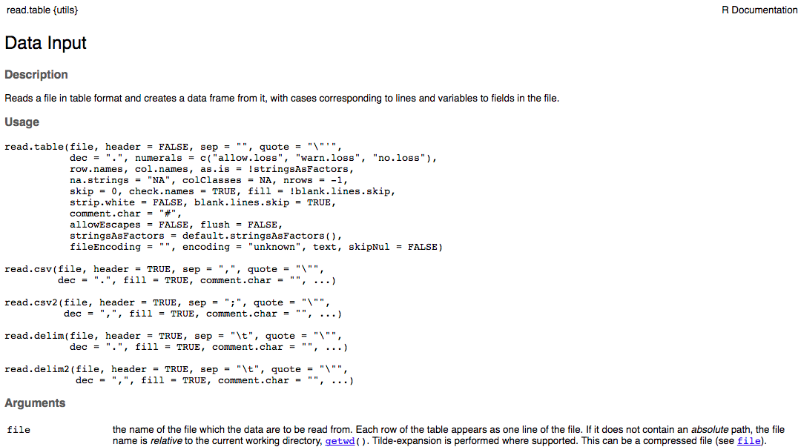
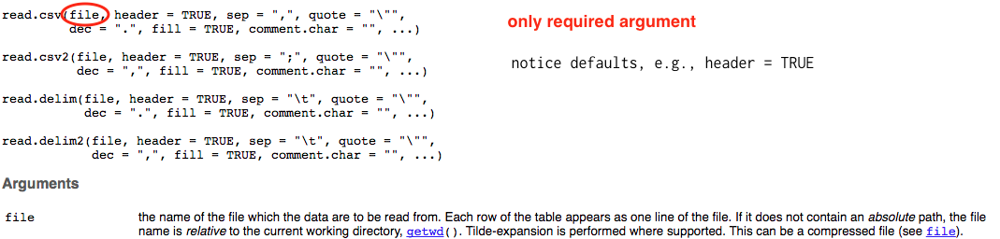
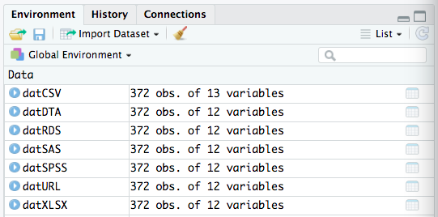
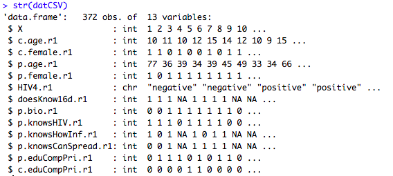

## {data-background="w03-cover.jpg"}

<style type="text/css">
p { text-align: left; }
</style>

## Objectives 

By the end of this session, you should be able to:

* Import data from CSV, RDS, Stata, SAS, SPSS, URLs, and APIs
* Inspect R objects
* Conduct initial data checks 

## <span style="color:red">Two steps forward, one step back</span> {data-background-image="https://media.giphy.com/media/3oEduZ9znjJjORaZW0/giphy.gif"}

## Login to Duke's Docker-ized version of RStudio Server

* Login to your instance by going to [https://vm-manage.oit.duke.edu/containers](https://vm-manage.oit.duke.edu/containers) and entering your NetID. 
* Click on Docker
* Click on RStudio
* When RStudio loads, restart the R session (`Ctrl/Cmd+Shift+F10`), clear the console (`Ctrl/Cmd+L`), and clear your workspace 

## Open your project

Is your project still open? If not, click on the project icon to load it. (Don't create a new one.)

<center>

</center>

## Download and open the template

Change `products` to your preferred subfolder.

```{r, eval=FALSE}
  download.file("https://tinyurl.com/yarmjp8w", 
                destfile = "products/lab-w03.Rmd")
```

## Import CSV

A csv file is an ideal format for sharing data. Simple. Lightweight. Readable by any program. Import with the `read.csv()` function. Start by running `?read.csv` in the console to view the help file.

<center>

</center>

## ? Help File

`?read.csv`: What arguments are required?

<center>

</center>

## Import CSV

Now import the csv file:

```{r loadCSV, eval=FALSE}
  datCSV <- read.csv("input/r2d2-w02.csv", stringsAsFactors = FALSE)
```

This will create an object called `datCSV`.

## {data-background-iframe="http://adv-r.had.co.nz/Style.html"}

## What's in a name

You can name this object anything you want. The most important thing is to be consistent. Here's Hadley's advice:

* Create meaningul names, not `foo` or `Eric2`
* Variable and function names should be lowercase
* Use an underscore (_) to separate words within a name 
* Variable names should be nouns and function names should be verbs
* camelCase is an option and can be used with _, as in `datWave1_wide`

## RDS

Any R object can be saved as an RDS file, so you might need to import from RDS on occassion:

```{r loadRDS, eval=FALSE}
  datRDS <- readRDS("input/r2d2-w02.rds")
```

## Import from other stats programs

Maybe a collaborator works in Stata, SAS, or (gasp!) SPSS and wants to make the jump to R. No problem, just load the `haven` package:

```{r loadSTAT, eval=FALSE}
# install.packages("haven") # probably need to install this first
  library(haven)
  datDTA <- read_dta("input/r2d2-w02.dta")
  datSAS <- read_sas("input/r2d2-w02.sas7bdat")
  datSPSS <- read_sav("input/r2d2-w02.sav")
```

## Import from Excel

Or maybe you have descended into the 6th circle of hell (heresy) and you are given data stored in Excel files. You can manually convert to CSV files and import, or you can use the `readxl` package that is part of the `tidyverse`.

```{r loadXLSX, eval=FALSE}
  library(readxl)
  excel_sheets("input/r2d2-w02.xlsx")  # list sheets
  datXLSX <- read_excel("input/r2d2-w02.xlsx", sheet="data")
```

## Import flat files from the Web

You can use the `RCurl` package to grab data from the web. This link goes to a csv published on Google Drive.

```{r loadURL, eval=FALSE}
  library(RCurl)
  url <- getURL('https://docs.google.com/spreadsheets/d/e/2PACX-1vQLJfY4Hk0Uek5lLBxXrowCp-7XMP1_5Vze6grhUd5u_XcIlMzTkpwBG3sq0aZuzduNbpiv1oqPyd1w/pub?gid=1835311741&single=true&output=csv', 
                ssl.verifyhost=FALSE, ssl.verifypeer=FALSE)
  datURL <- read.csv(textConnection(url), header=T)
```

(Check out the [`googlesheets` package](https://cran.r-project.org/web/packages/googlesheets/vignettes/basic-usage.html) if you want to read and write from YOUR Google Sheets account.)

## Import data from APIs

```{r loadJSON}
  source("https://tinyurl.com/y74jnzsc") # authentication code
  twitter_user <- "realDonaldTrump"
  url <- paste0("https://api.twitter.com/1.1/statuses/user_timeline.json?",
                "count=10&",
                "screen_name=", twitter_user)
  req <- httr::GET(url, httr::add_headers(Authorization = token))
  json <- httr::content(req, as = "text")
  tweets <- fromJSON(json)
  substring(tweets$text, 1, 100)
```

## Connect to Databases

RStudio makes it easy to connect to a wide range of databases, query/analyze the data inside the database, and only import what you need into R. 

<center>

</center>

See [RStudio](https://db.rstudio.com/) for more details.

## Check out your data frames

If successful, you should see 7 `dat` dataframes in your environment. We'll focus on `datCSV` moving forward.

<center>

</center>

## Inspect the object

```{r str, eval=FALSE}
  str(datCSV)
```

<center>

</center>

## Data frame {data-background=#f4c842}

R has several data types. `datCSV` is a **data frame** that consists of 372 rows and 12 variables. Let's use two built-in functions to do this count and print the results in line. Go to where you see the following line:

> The `datCSV` data frame has ... observations (rows) and ... columns.

Replace the first `...` with \``nrow(datCSV)`\` for the number of rows, and replace the second `...` with \``length(datCSV)`\` for the number of columns. Then knit your document.

## Glimpse

We can also examine `datCSV` with the `glimpse()` function in the `dplyr` package, which is included in the `tidyverse`. 

```{r glimpse, eval=FALSE}
  library(tidyverse)
  glimpse(datCSV)
```

## Hide output {data-background=#f4c842}

Knit the file and you'll see that the glimpse results print. Replace `{r glimpse}` with `{r glimpse, results='hide'}` and knit again.

## Stop code from printing {data-background=#f4c842}

To turn off code printing, replace `{r glimpse, results='hide'}` with `{r glimpse, results='hide', echo=FALSE}` and knit again.

## Head/Tail

You can also use the functions `head()` or `tail()` to examine the first or last few rows.

```{r head, eval=FALSE}
  head(datCSV)
  tail(csv)
```

## Quick exploration

One option for a quick summary of the dataframe is:

```{r summary, eval=FALSE}
  summary(datCSV)
```

But this can be unweildly when your dataframe is big.

## Start by looking for problems

* Do any variables have values that are smaller or larger than you thought possible? See `min` and `max` of `summary()` output or run `min(datCSV$p.age.r1, na.rm=TRUE)` or `max(datCSV$p.age.r1, na.rm=TRUE)`.
* Are any variables missing more data than you would have expected? 

```{r table, eval=FALSE}
  names(datCSV)
  table(datCSV$p.knowsHowInf.r1, useNA="always")
```

`names(datCSV)` is a quick way to get the names of all variables (columns) in a dataframe.

## Introduction to $

* `datCSV` tells R to do something with the `datCSV` dataframe
* `datCSV` followed by the `$` lets you access specific columns; RStudio will prompt you with column names as soon as you type `$` after the name of a dataframe

## Introduction to NA

* NA means missing data in R
* A common trap in analysis is not understanding how the function you are using handles NAs by default

```{r missing, eval=FALSE}
  is.na(datCSV$p.knowsHowInf.r1) # gives a logical T/F if values is missing
  sum(is.na(datCSV$p.knowsHowInf.r1)) # another way to count NA
  any(is.na(datCSV$p.knowsHowInf.r1)) # tests if there are any NAs
```

## Vectors

With `is.na(datCSV$p.knowsHowInf.r1)` we see a second data type: vectors. This vector stores data of the logical class.

```{r logical, eval=FALSE}
  knowsHowInf <- is.na(datCSV$p.knowsHowInf.r1)
  str(knowsHowInf)
  knowsHowInf[1:20]
  # [1] FALSE FALSE FALSE  TRUE FALSE FALSE FALSE FALSE  TRUE  TRUE FALSE FALSE FALSE  TRUE
  #[15]  TRUE FALSE  TRUE FALSE FALSE FALSE
```

## Two-way contingenecy tables

One of the first things to always inspect are frequencies. Do your N's make sense? What about when you cross two key categorical variables?

```{r contingency, eval=FALSE}
  tblKnow_posByHow <- table(datCSV$p.knowsHIV.r1,
                            datCSV$p.knowsHowInf.r1, 
                            useNA="always", 
                            dnn=c("knows HIV+", 
                                  "knows how infected"))
  tblKnow_posByHow
  
  margin.table(tblKnow_posByHow, 1) # row total
  margin.table(tblKnow_posByHow, 2) # column total
```

## Table of proportions

```{r proportions, eval=FALSE}
  prop.table(tblKnow_posByHow) # cell frequencies
  prop.table(tblKnow_posByHow, 1) # row percentages
  prop.table(tblKnow_posByHow, 2) # column percentages
```

## Quick plots

We'll learn how to create awesome plots, but not today. When you are inspecting your data, R's base plots are quick, easy, and sufficient.

```{r plots, eval=FALSE}
  boxplot(datCSV$p.age.r1)
  hist(datCSV$p.age.r1)
```

## Next Up: Pipes!

Select, filter, arrange, mutate, summarise
