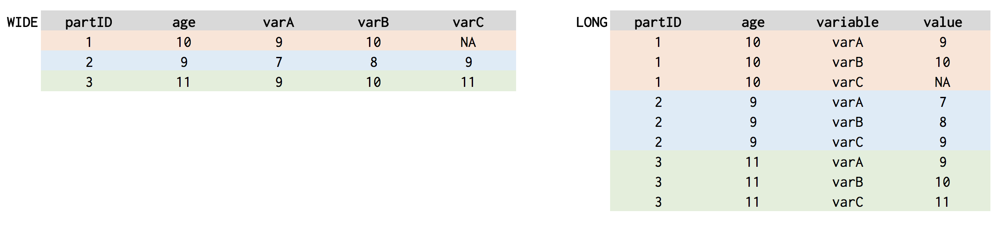

## {data-background="w04-cover.jpg"}

<style type="text/css">
p { text-align: left; }
</style>

## You are here

<center>

</center>

## Objectives 

By the end of this session, you should be able to:

* Import raw data
* Transform your data using the `dplyr` package, a member of the tidyverse
* Create this plot...

## Create this plot

<center>

</center>

## {data-background-iframe="https://docs.google.com/presentation/d/e/2PACX-1vSFK2JJs9RvbNov-HOvAvcfGjV_9GNJnLtC2J2Or1R5LEY7Z4WL4oOfmIS9misHHeKIyM6Kh1PvSMqi/embed?start=false&loop=false&delayms=60000" frameborder="0" width="1440" height="839" allowfullscreen="true" mozallowfullscreen="true" webkitallowfullscreen="true"}

## <span style="color:red">Tidy up!</span> {data-background-image="https://media.giphy.com/media/HIrYP4RI9DpLy/giphy.gif"}

## Login to Duke's Docker-ized version of RStudio Server

* Login to your instance by going to [https://vm-manage.oit.duke.edu/containers](https://vm-manage.oit.duke.edu/containers) and entering your NetID. 
* Click on Docker
* Click on RStudio
* When RStudio loads, restart the R session (`Ctrl/Cmd+Shift+F10`), clear the console (`Ctrl/Cmd+L`), and clear your workspace 

## Open your project

Is your project still open? If not, click on the project icon to load it. (Don't create a new one.)

<center>

</center>

## Download and open the template

Run the following code in your console. Change `products` to your preferred subfolder.

```{r, eval=FALSE}
  download.file("https://tinyurl.com/y9ze2grp", 
                destfile = "products/lab-w04.Rmd")
```

## Optional: Change your layout

`Tools > Global Options`

<center>

</center>

## Download and import the data

Run the `download` code chunk to get the data, and then write a line of code in the `loadCSV` chunk to import the data to your environment and assign it to an object called `dat`.

## Inspect dat

Load the `tidyverse` package and take a quick glimpse at the data. Try `glimpse()`, then turn `dat` into a tibble.

```{r glimpse, eval=FALSE}
  dat <- as.tibble(dat)
```

## 5 key functions

function      purpose
--------      --------
`filter()`    Pick observations by their values
`arrange()`   Reorder the rows
`select()`    Pick variables by their names
`mutate()`    Create new variables
`summarise()` Create summaries

(http://r4ds.had.co.nz/transform.html)

## Filter

`filter()` lets you subset based on row values. Just give it a data frame and one or more conditions.

```{r, eval=FALSE}
  filter(dat, c.age.r1 < 13) # younger than 13
  filter(dat, c.age.r1 >= 11 & c.age.r1 <= 13) # between 11 and 13
  filter(dat, c.female.r1 != 0) # exclude males coded as 0's
  filter(dat, c.female.r1 == 1) # include females coded as 1's
  filter(dat, c.age.r1 < 13, c.female.r1 == 1) # females younger than 13
  filter(dat, (c.female.r1 == 1 & c.age.r1 < 11) | # females younger than 11
              (c.female.r1 == 0 & c.age.r1 > 12)) # OR males older than 12
```

Logical operators and (`&`), or (`|`), not (`!`), equals (`==`). How many observations do we have of female caregivers (`p.female.r1`) and female children (`c.female.r1`)?

## Arrange

`arrange()` sorts your dataframe according to one or more conditions.

```{r arrange, eval=FALSE}
  arrange(dat, p.female.r1, p.age.r1) # both ascending
  arrange(dat, p.female.r1, desc(p.age.r1)) # descending age
```

Try arranging by child age and then gender. Note how the order matters.

## Select

`select()` lets you grab just a subset of columns from your data frame.

```{r select, eval=FALSE}
  select(dat, p.female.r1, c.female.r1)
  select(dat, starts_with("p.")) # grab all p. columns
  select(dat, ends_with(".r1")) # grab all .r1 columns
  select(dat, contains("age")) # grab all age columns
```

Get all of the "knows" variables.

## Mutate

`mutate()` creates new columns. In this example, we first create a smaller data frame called `temp` to make it easier to see the new variable `ageDifference` that we create in the second step.

```{r mutate, eval=FALSE}
  temp <- select(dat, contains("age"), c.female.r1) # females + all age columns
  mutate(temp, ageDiff = p.age.r1 - c.age.r1, # parent age - kid age
               ageDiffLog = log(ageDiff), # log of age difference
               age50 = ifelse(p.age.r1 >=50, 1, 0)) # 1 if diff at least 50yrs
```

Add a step to mutate that creates a variable in `temp` called `ageDiff50` that equals `1` if the age difference between kids and caregivers is at least 50 years.

## Summarise

`summarise()` collapses the data to summary values. It can be used with the `group_by` function to summari(z)e by group.

```{r summarise, eval=FALSE}
  summarise(temp, c.ageM = mean(c.age.r1)) # mean of child age
  by_gender <- group_by(temp, c.female.r1) # group by child gender
  summarise(by_gender, c.ageM = mean(c.age.r1))
```

## <span style="color:red">Pipes!</span> {data-background-image="https://media.giphy.com/media/3o6Mb8Tdiy6P0QRQIM/giphy.gif"}

## The Pipe

`%>%`

We can "pipe" together multiple steps without having to make intermediate objects like `temp`.

```{r pipes, eval=FALSE}
# meanAge <-   # optional to assign result to some object 
  dat %>% 
    select(contains("age"), c.female.r1) %>%
    mutate(ageDiff = p.age.r1 - c.age.r1) %>%
    group_by(c.female.r1) %>%
    summarise(c.ageM = mean(c.age.r1))
```

Create a pipe that calculates the mean age difference between parents and kids by parent gender.

## Our Objective

<center>

</center>

## Data dictionary

To make this plot, we need 4 sets of variables that assess what the child knows and when he/she learned

<center>

</center>

## Construct new variables: Full disclosure

The first variable to construct is an indicator of whether we should classify the child as meeting criteria for full disclosure. We use the `case_when()` function and a few logical operators to create this new variable `p.fullDisclosure.r1`.

```{r fullDisclosure, eval=FALSE}
  temp2 <- 
  mutate(dat,
         p.fullDisclosure.r1 = case_when(
            doesKnow16.r1=="yes, child knows" &
            doesKnow20.r1=="yes, child knows" &
            doesKnow24.r1=="yes, child knows" ~ 1, 
            TRUE ~ 0
            )
         )
  temp2$p.fullDisclosure.r1
```

(We create `temp2` just to make it easy to see the result.)

## Construct new variables: Age at full disclosure

```{r ageFull, eval=FALSE}
  temp2 <- 
  mutate(temp2,
         ageFull = pmax(doesKnow23.r1, doesKnow27.r1, na.rm=T)
         ) %>%
  mutate(ageFull = ifelse(p.fullDisclosure.r1==1, ageFull, NA)
  )
  temp2$ageFull
```

(We create `temp2` just to make it easy to see the result.)

## Pipe It!

```{r allTogetherNow, eval=FALSE}
dat <- 
  dat %>%
  # create indicator for full disclosure
  mutate(
    p.fullDisclosure.r1 = case_when(
      doesKnow16.r1=="yes, child knows" &
        doesKnow20.r1=="yes, child knows" &
        doesKnow24.r1=="yes, child knows" ~ 1, 
      TRUE ~ 0
    )
  ) %>%
  # get age of full disclosure
  mutate(
    ageFull = pmax(doesKnow23.r1, doesKnow27.r1, na.rm=T)
  ) %>%
  mutate(
    ageFull = ifelse(p.fullDisclosure.r1==1, ageFull, NA)
  )
```

## Now plot it!

```{r, eval=FALSE}
dat %>%
# select a subset of variables
  select(doesKnow15.r1, doesKnow19.r1,
         doesKnow23.r1, doesKnow27.r1,
         ageFull, c.age.r1) %>%
# transform the data from wide to long
  melt(., id="c.age.r1") %>%
  group_by(variable, value) %>%
  summarise(count=n()) %>% # summarise first to get count by age
  group_by(variable) %>% #
  mutate(all=sum(count),
         count=as.numeric(count), # this is so that it goes in numeric order
         value=as.numeric(value)) %>%
  filter(!is.na(value)) %>%
  arrange(variable, value) %>%
  group_by(variable) %>%
  mutate(csum=cumsum(count),
         pct=(csum/all)*100) %>%
  mutate(label=ifelse(variable=="doesKnow15.r1", "Chronic Condition",
                      ifelse(variable=="doesKnow19.r1", "HIV Status",
                      ifelse(variable=="doesKnow23.r1", "How Infected",
                      ifelse(variable=="doesKnow27.r1", "Can Spread",
                      ifelse(variable=="ageFull", "Full Disclosure", 
                             "WTF")))))
         ) %>%
  data.frame(.) %>% # before you can rbind, you need to data.frame(.) it 
  rbind(., zeroDat) %>% 
  mutate(label=ifelse(value==15, label, "")) %>%
  mutate(hiv=ifelse(variable=="doesKnow19.r1", "hiv", "not")) %>%
    
# start plot, wrap it in braces 
  {
   ggplot(., aes(x=as.factor(value), y=as.numeric(pct), 
                 color=variable, group=variable, label=label, 
                 linetype=variable, size=hiv)) +
      geom_line() +
      scale_size_manual(values=c(2,1)) +
      ylim(0,100) +
      labs(x="Age", y="Percent (%)") +
      theme_minimal() +
      geom_hline(yintercept=50, linetype="dotted") +
      theme(legend.title=element_blank()) +
      geom_text(data=filter(., value==15), 
                aes(x=as.factor(value), y=as.numeric(pct), label=label),
                vjust=c(rep(-1, 4), 4), hjust=1, size=4) +
      scale_color_manual(values=c("black", rep("black", 4))) +
      scale_linetype_manual(values=c("dashed", "solid", "solid",
                                     "solid", "solid"), name="") +
      guides(color=FALSE) +
      guides(linetype=FALSE) +
      guides(size=FALSE) +
      theme(panel.grid.major=element_blank(),
            panel.grid.minor=element_blank()) +
      theme(legend.position = "bottom")
  }
```

## Transform from wide to long

Highlight and run from the start through the `melt()` line, but don't include the pipe operator. 

```{r, eval=FALSE}
dat %>%
  select(doesKnow15.r1, doesKnow19.r1,
         doesKnow23.r1, doesKnow27.r1,
         ageFull, c.age.r1) %>%
  melt(., id="c.age.r1")
```

<center>

</center>

## Get counts by age and variable

```{r, eval=FALSE}
  group_by(variable, value) %>%
  summarise(count=n())
```

<center>

</center>

## Add a count of all observations (372)

```{r, eval=FALSE}
  group_by(variable) %>% #
  mutate(all=sum(count),
         count=as.numeric(count), # this is so that it goes in numeric order
         value=as.numeric(value))
```

<center>

</center>

## Drop NA, sort, and calculate cumulative counts

```{r, eval=FALSE}
  filter(!is.na(value)) %>%
  arrange(variable, value) %>%
  group_by(variable) %>%
  mutate(csum=cumsum(count),
         pct=(csum/all)*100)
```

<center>

</center>

## Add variable labels

```{r, eval=FALSE}
  mutate(label=ifelse(variable=="doesKnow15.r1", "Chronic Condition",
               ifelse(variable=="doesKnow19.r1", "HIV Status",
               ifelse(variable=="doesKnow23.r1", "How Infected",
               ifelse(variable=="doesKnow27.r1", "Can Spread",
               ifelse(variable=="ageFull", "Full Disclosure", "WTF"))))))
```

<center>

</center>

## Sometimes you need a few hacks

```{r, eval=FALSE}
  data.frame(.) %>% # before you can rbind, you need to data.frame(.) it 
  rbind(., zeroDat) %>% 
  mutate(label=ifelse(value==15, label, "")) %>%
  mutate(hiv=ifelse(variable=="doesKnow19.r1", "hiv", "not"))
```

## Voila

<center>

</center>


