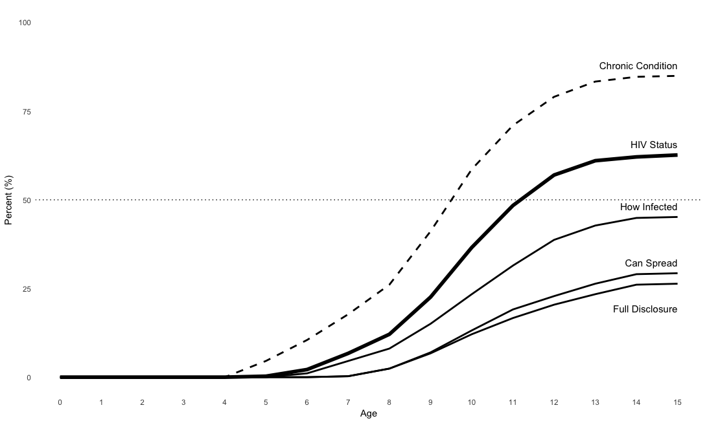
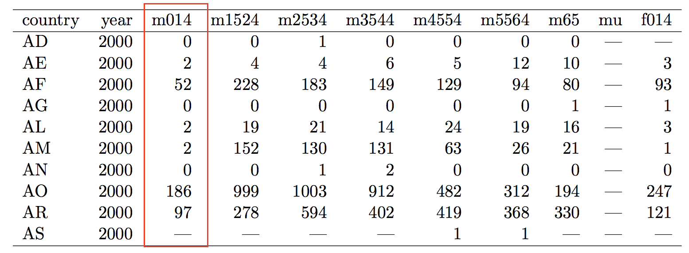
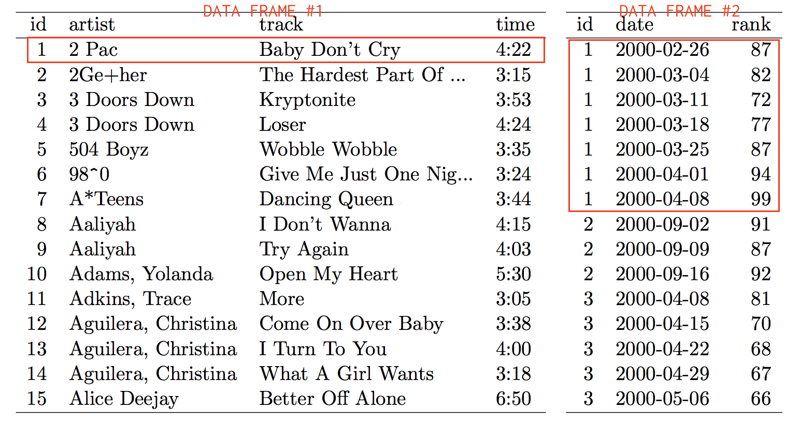

```{r setup, include=FALSE}
  library(knitr)
  knitr::opts_chunk$set(echo = TRUE)
  opts_knit$set(root.dir=normalizePath('../'))
```

## {data-background="w05-cover.jpg"}

<style type="text/css">
p { text-align: left; }
</style>

## Last week

We learned the big 5 data transformation functions in the `dplyr` package:

function      purpose
--------      --------
`filter()`    Pick observations by their values
`arrange()`   Reorder the rows
`select()`    Pick variables by their names
`mutate()`    Create new variables
`summarise()` Create summaries

(http://r4ds.had.co.nz/transform.html)

## Last week

And we used these functions to create this plot:

<center>

</center>

## Today we'll focus on tidy data

<center>

</center>

https://www.rstudio.com/resources/cheatsheets/

## Objectives 

By the end of this session, you should be able to:

* Explain what makes data "tidy", and why messy data suck
* Tidy data using the `tidyr` package, a member of the tidyverse
* Make a participant characteristics table

## Login to Duke's Docker-ized version of RStudio Server

* Login to your instance by going to [https://vm-manage.oit.duke.edu/containers](https://vm-manage.oit.duke.edu/containers) and entering your NetID. 
* Click on Docker
* Click on RStudio
* When RStudio loads, restart the R session (`Ctrl/Cmd+Shift+F10`), clear the console (`Ctrl/Cmd+L`), and clear your workspace 

## Open your project

Is your project still open? If not, click on the project icon to load it. (Don't create a new one.)

<center>

</center>

## Download and open the template

Run the following code in your console. Change `products` to your preferred subfolder.

```{r, eval=FALSE}
  download.file("https://tinyurl.com/y7tmv7uh", 
                destfile = "products/lab-w05.Rmd")
```

## Optional: Change your layout

`Tools > Global Options`

<center>

</center>

## Tidy Data

> Tidy datasets are easy to manipulate, model and visualize, and have a specific structure: each variable is a column, each observation is a row, and each type of observational unit is a table [@wickham2014] 

Wickham also uses tidy as a verb meaning "to structure a dataset to facilitate analysis".

## Messy Data 1: Column Headers Are Values

<center>

</center>

How many variables are in this dataset? This table and the following from @wickham2014.

## Tidy Data 1: Melt

Columns are variables and rows are observations (i.e., combination of religion and income):

<center>

</center>

## Messy Data 2: Multiple variables stored in one column

<center>

</center>

How would you link up with population data by country and age group to calculate rates? (*answer: after tidying*)

## Tidy Data 2: Melt and Split

<center>

</center>

## Messy Data 3: Variables are stored in both rows and columns

<center>

</center>

The `element` column is not a variable with values, but rather a vector of variable names.

## Tidy Data 3: Melt and Cast

Every row becomes an observation (i.e., weather station by date) with two measurements:

<center>

</center>

## Messy Data 4: Multiple types in one table

This style of data entry and storage invites errors and inconsistencies:

<center>

</center>

## Tidy Data 4: Use different tables for different levels

<center>

</center>

## <span style="color:red">Don't Cry, Tidy!</span> {data-background-image="https://media.giphy.com/media/E2uKqBQURFHfG/giphy.gif"}

## The Tidy 4

function      purpose
--------      --------
`gather()`    Gather variable values spread across multiple columns
`spread()`    Spread out observation values scattered across rows 
`separate()`  Split one column into two or more columns
`unite()`     Collapse multiple columns into one column

(http://r4ds.had.co.nz/tidy-data.html)

## Some Simple Examples

Load the `tidyverse` package and look at the included dataset called `table4a`.

```{r, message=FALSE}
  library(tidyverse)
  table4a
```

What is messy about this tibble?

## `gather()`

1999 and 2000 are values, not variables. The variable should be `year`.

<center>

</center>

Examples and figures from @wickham2017

## `gather()`

```{r}
  table4a %>%  # remember pipes?
    gather(`1999`, `2000`, key = "year", value = "cases")
```

We gather values by a set of column names that define the `key`, which we name `year`. We then store the values in a new variable called `cases`.

## `gather()`

We get the same result excluding country with a `-` sign. Note that we've also removed the parameter names `key` and `value`. This is possible because the default for `gather()` expects you to specify key before value. See `?gather`.  

```{r}
  table4a %>%  # remember pipes?
    gather("year", "cases", -country)
```

## `gather()`

Try gathering `table4b` (also included with `tidyverse`) to create variables for year and population values (call it "population").

```{r}
  table4b
```

## `spread()`

Now look at `table2`. `type` is not a variable!

```{r}
  table2
```

## `spread()`

Let's use `spread()` to make two proper variables: `cases` and `population`.

<center>

</center>

## `spread()`

The `key` in this example is the `type` column, and the values we want to spread are stored in `count`.

```{r}
  table2
```

## `spread()`

Just like with `gather()`, we'll pass two arguments to `spread()` in addition to an object: `key` and `value`.

```{r}
  spread(table2, key = type, value = count)
```

## <span style="color:red">`spread` out wide, or `gather` (stack) into a long (tall) pile</span> {data-background-image="https://media.giphy.com/media/Oi9xgpNEiI8us/giphy.gif"}

## split and combine columns

The `separate()` and `unite()` functions split and combine columns.

## `separate()`

Here we want split `rate` into two columns: `cases` and `population`

<center>

</center>

## `separate()`

It's simple. Just tell R the column to split and the columns to create:

```{r}
  table3 %>% 
    separate(col = rate, into = c("cases", "population"))
```

## `separate()`

`separate()` is smart enough to know to split on "/", but you can also specify with `sep = "/"`. The `convert==TRUE` argument will guess at the data type rather than leave the new columns characters.

```{r}
  table3 %>% 
    separate(col = rate, into = c("cases", "population"), 
             sep="/", convert = TRUE)
```

## `separate()`

Can also separate on a specific character position with the `sep` argument. For example, we separate `year` into `century` and `year` by specifying `sep==2`. Count from left (1, 2, ...) or from right (-1, -2, ...).

```{r}
  table3 %>% 
    separate(col = year, into = c("century", "year"), sep=2)
```

## `unite()`

`unite()` does the opposite: it combines two or more columns into one.

<center>

</center>

## `unite()`

In this example, `new` is the name of the new column we want to create by combining columns `century` and `year`. 

```{r}
  table5 %>% 
    unite(col = new, century, year)
```

## `unite()`

By default `unite()` will add an underscore, but adding `sep=""` (no space) will combine without the `_`.

```{r}
  table5 %>% 
    unite(col = new, century, year, sep = "")
```

## Missing values

One last point to consider is how to handle missing values when transforming data. Let's make a tibble called `stocks` with 2 years of quarterly data on returns.

```{r}
  stocks <- tibble(
    year   = c(2015, 2015, 2015, 2015, 2016, 2016, 2016),
    qtr    = c(   1,    2,    3,    4,    2,    3,    4),
    return = c(1.88, 0.59, 0.35,   NA, 0.92, 0.17, 2.66)
)
```

## Missing values

There are two types of missing data: 

1. Explicit: Q4 of 2015 is present in the data, but there is no value.
2. Implicit: Q1 of 2016 is not even present in the data

## Make missing explicit

`complete()` returns all combinations of a set of columns and will fill in `NA` when combinations are missing.

```{r}
  stocks %>% 
    complete(year, qtr)
```

## Our objective

Now we want to use the disclosure data from the first wave to create a participant characteristics table:

```{r echo=FALSE}
  library(kableExtra)
  download.file("https://www.dropbox.com/s/g8ufwky4npt26as/r2d2-w04.csv?dl=1", 
                destfile = "input/r2d2-w04.csv")
  dat <- read.csv("input/r2d2-w04.csv", stringsAsFactors = FALSE)
  dat %>%
      mutate(p.disclosed = case_when(
                doesKnow16.r1=="yes, child knows" ~ "disclosed", 
                TRUE ~ "non-disclosed"
                )) %>%
      group_by(p.disclosed) %>%
      summarise(c.age=round(mean(c.age.r1, na.rm=TRUE), 1),
                p.age=round(mean(p.age.r1, na.rm=TRUE), 1),
                c.female=round(mean(c.female.r1, na.rm=TRUE)*100, 1),
                p.female=round(mean(p.female.r1, na.rm=TRUE)*100, 1)) %>%
      gather(., key="variable", value="value", -p.disclosed) %>%
      spread(., key=p.disclosed, value=value) %>%
  kable()
```


## Get the data

If you completed the Week 4 tutorial, you should already have the data file you need for today. If not, run the download chunk in your template.

Once you have the data (a csv file), import it into R and assign to an object called `dat`.

## Import

```{r loadCSV, eval=FALSE}
  dat <- read.csv("input/r2d2-w04.csv", stringsAsFactors = FALSE)
```

## Start with a simple summary

Let's start by remembering how to summarize our data. Use the `dplyr` package to get the means of `c.age.r1` and `p.age.r1`. What functions can you use?

## Start with a simple summary

You can use `summarise()` and `mean()` to get the means of `c.age.r1` and `p.age.r1`.

```{r mean}
  summarise(dat, c.age=mean(c.age.r1, na.rm=TRUE),
                 p.age=mean(p.age.r1, na.rm=TRUE))
```

## The same thing with a pipe!

```{r mean_pipe}
  dat %>%
  # notice we omit the object name dat since piped
    summarise(c.age=mean(c.age.r1, na.rm=TRUE),
              p.age=mean(p.age.r1, na.rm=TRUE))
```

## Create an indicator for knows status

We want to compare participant characteristics by the disclosure status of the child at baseline. The relevant variable is `doesKnow16.r1`. What can you add before `summarise()` to create this indicator variable? Use `table()` to remind yourself how this variable was coded.

```{r coded}
  table(dat$doesKnow16.r1)
```

## Create an indicator for knows status

```{r indicator}
  dat %>%
    mutate(p.disclosed = case_when(
              doesKnow16.r1=="yes, child knows" ~ 1, 
              TRUE ~ 0
              )) %>%
  # only including here to show the new variable
    select(p.disclosed) %>% 
    glimpse() 
```

## Now summarize by disclosure status

Add something after `mutate()` to prepare to summarize the data. 

## Now summarize by disclosure status

The `group_by()` function can be used with `summarise()` to tell R to perform the summary by disclosure status.

```{r mean_by}
  dat %>%
    mutate(p.disclosed = case_when(
              doesKnow16.r1=="yes, child knows" ~ "disclosed", 
              TRUE ~ "non-disclosed"
              )) %>%
    group_by(p.disclosed) %>%
    summarise(c.age=mean(c.age.r1, na.rm=TRUE),
              p.age=mean(p.age.r1, na.rm=TRUE))
```

## Add other variables to summarize

Use `names()` to remind yourself of the variables in `dat`. You can skip the "doesKnow" variables.

```{r names}
  names(dat)
```


## Add other variables to summarize

```{r all_vars}
  dat %>%
    mutate(p.disclosed = case_when(
              doesKnow16.r1=="yes, child knows" ~ "disclosed", 
              TRUE ~ "non-disclosed"
              )) %>%
    group_by(p.disclosed) %>%
    summarise(c.age=mean(c.age.r1, na.rm=TRUE),
              p.age=mean(p.age.r1, na.rm=TRUE),
              c.female=mean(c.female.r1, na.rm=TRUE),
              p.female=mean(p.female.r1, na.rm=TRUE))
```

## Check out your tibble

Formatting aside, does this tibble resemble a table of participant characteristics you might see in an article?

```{r echo=FALSE}
  dat %>%
    mutate(p.disclosed = case_when(
              doesKnow16.r1=="yes, child knows" ~ "disclosed", 
              TRUE ~ "non-disclosed"
              )) %>%
    group_by(p.disclosed) %>%
    summarise(c.age=mean(c.age.r1, na.rm=TRUE),
              p.age=mean(p.age.r1, na.rm=TRUE),
              c.female=mean(c.female.r1, na.rm=TRUE),
              p.female=mean(p.female.r1, na.rm=TRUE))
```

## Not quite

What functions from `tidyr` can help us get there?

## Use `gather()`

```{r gather}
  dat %>%
    mutate(p.disclosed = case_when(
              doesKnow16.r1=="yes, child knows" ~ "disclosed", 
              TRUE ~ "non-disclosed"
              )) %>%
    group_by(p.disclosed) %>%
    summarise(c.age=mean(c.age.r1, na.rm=TRUE),
              p.age=mean(p.age.r1, na.rm=TRUE),
              c.female=mean(c.female.r1, na.rm=TRUE),
              p.female=mean(p.female.r1, na.rm=TRUE)) %>%
    gather(., key="variable", value="value", -p.disclosed)
```

## Are we there yet?

```{r, echo=FALSE}
  dat %>%
    mutate(p.disclosed = case_when(
              doesKnow16.r1=="yes, child knows" ~ "disclosed", 
              TRUE ~ "non-disclosed"
              )) %>%
    group_by(p.disclosed) %>%
    summarise(c.age=mean(c.age.r1, na.rm=TRUE),
              p.age=mean(p.age.r1, na.rm=TRUE),
              c.female=mean(c.female.r1, na.rm=TRUE),
              p.female=mean(p.female.r1, na.rm=TRUE)) %>%
    gather(., key="variable", value="value", -p.disclosed)
```

What do we need to do?

## Use `spread()`

```{r spread}
  dat %>%
    mutate(p.disclosed = case_when(
              doesKnow16.r1=="yes, child knows" ~ "disclosed", 
              TRUE ~ "non-disclosed"
              )) %>%
    group_by(p.disclosed) %>%
    summarise(c.age=mean(c.age.r1, na.rm=TRUE),
              p.age=mean(p.age.r1, na.rm=TRUE),
              c.female=mean(c.female.r1, na.rm=TRUE),
              p.female=mean(p.female.r1, na.rm=TRUE)) %>%
    gather(., key="variable", value="value", -p.disclosed) %>%
    spread(., key=p.disclosed, value=value)
```

## Make it a bit nicer

```{r nicer}
  dat %>%
    mutate(p.disclosed = case_when(
              doesKnow16.r1=="yes, child knows" ~ "disclosed", 
              TRUE ~ "non-disclosed"
              )) %>%
    group_by(p.disclosed) %>%
    summarise(c.age=round(mean(c.age.r1, na.rm=TRUE), 1),
              p.age=round(mean(p.age.r1, na.rm=TRUE), 1),
              c.female=round(mean(c.female.r1, na.rm=TRUE)*100, 1),
              p.female=round(mean(p.female.r1, na.rm=TRUE)*100, 1)) %>%
    gather(., key="variable", value="value", -p.disclosed) %>%
    spread(., key=p.disclosed, value=value) %>%
    kable()
```


## References

