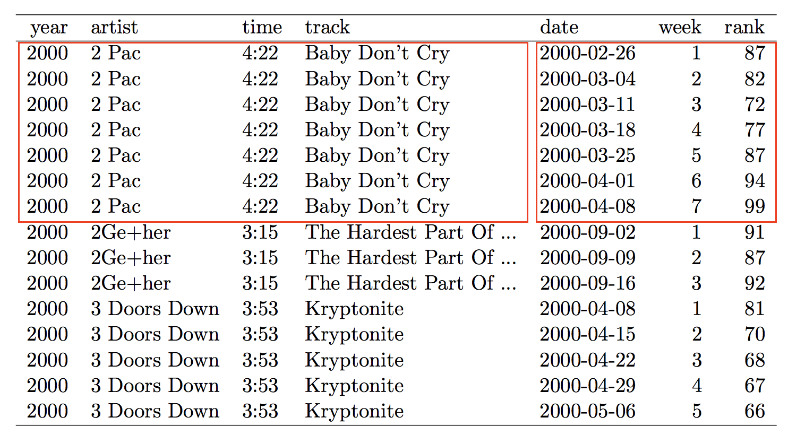

```{r setup, include=FALSE}
  library(knitr)
  knitr::opts_chunk$set(echo = TRUE)
  opts_knit$set(root.dir=normalizePath('../'))
  library(tidyverse)
  library(nycflights13)
```

## {data-background="w06-cover.jpg"}

<style type="text/css">
p { text-align: left; }
</style>

## Last week

We learned 4 functions in the `tidyr` package:

function      purpose
--------      --------
`gather()`    Gather variable values spread across multiple columns
`spread()`    Spread out observation values scattered across rows 
`separate()`  Split one column into two or more columns
`unite()`     Collapse multiple columns into one column

(http://r4ds.had.co.nz/transform.html)

## Last week

And we used these functions and a few from Week 4 to create this table:

```{r nicer, echo=FALSE}
  dat <- read.csv("input/r2d2-w04.csv", stringsAsFactors = FALSE)
  dat %>%
    mutate(p.disclosed = case_when(
              doesKnow16.r1=="yes, child knows" ~ "disclosed", 
              TRUE ~ "non-disclosed"
              )) %>%
    group_by(p.disclosed) %>%
    summarise(c.age=round(mean(c.age.r1, na.rm=TRUE), 1),
              p.age=round(mean(p.age.r1, na.rm=TRUE), 1),
              c.female=round(mean(c.female.r1, na.rm=TRUE)*100, 1),
              p.female=round(mean(p.female.r1, na.rm=TRUE)*100, 1)) %>%
    gather(., key="variable", value="value", -p.disclosed) %>%
    spread(., key=p.disclosed, value=value) %>%
    kable()
```

## Objectives 

Today we'll focus on relational data. Some of today's examples come from @wickham2017. By the end of this session, you should be able to:

* Understand what makes data "relational"
* Perform inner and outer joins

## Login to Duke's Docker-ized version of RStudio Server

* Login to your instance by going to [https://vm-manage.oit.duke.edu/containers](https://vm-manage.oit.duke.edu/containers) and entering your NetID. 
* Click on Docker
* Click on RStudio
* When RStudio loads, restart the R session (`Ctrl/Cmd+Shift+F10`), clear the console (`Ctrl/Cmd+L`), and clear your workspace 

## Open your project

Is your project still open? If not, click on the project icon to load it. (Don't create a new one.)

<center>

</center>

## Download and open the template

Run the following code in your console. Change `products` to your preferred subfolder.

```{r, eval=FALSE}
  download.file("https://tinyurl.com/ybvgoovu", 
                destfile = "products/lab-w06.Rmd")
```

## Don't make this mistake

One of the core principles of tidy data is that each type of observational unit is a table. Here's the messy example from last week:

<center>

</center>

## A table for every level

<center>

</center>

## Relational data

We often work with this type of relational data. Sometimes the data are nested (e.g., kids within families, classrooms within schools) and we have different tables with data on each level. Other projects might involve data that just happen to be split across multiple tables that we need to bring together. In both cases, the tables are relational.

## Getting relational data into R

If you have related data stored in different files, you need to load the data into R and combine the data objects. That's what we'll do today.

If you have a relational database, you can use [RStudio](https://db.rstudio.com/) to connect to the database, query/analyze the data, and only import what you need into R. 

<center>

</center>

## nycflights13

We'll follow the lead of @wickham2017 and use the `nycflights13` package to learn the basics of relational data. Take a look at 5 tibbles: `flights`, `airlines`, `airports`, `planes`, and `weather`. 

```{r flights}
  flights
```

## nycflights13

Airline names by `carrier` code.

```{r airlines}
  airlines
```

## nycflights13

Airport details by `faa` airport codes.

```{r airports}
  airports
```

## nycflights13

Plane details by `tailnum`.

```{r planes}
  planes
```

## nycflights13

Weather details by airport (`origin` faa code) and day/hour.

```{r weather}
  weather
```

## See how the tibbles are related

<center>

</center>

## Focus on the key relationships

* `flights` links to `planes` by `tailnum`
* `flights` links to `airlines` by `carrier`
* `flights` links to `airports` by `origin` and `destination`
* `flights` links to `weather` by `origin` and the time variables

## Joins

When you want to combine a pair of tables, `x` and `y`, to make a bigger (wider) table, you **join** them. 

function        behavior
--------        --------
`inner_join()`  Keeps observations that appear in `x` AND `y`
`left_join()`   Keeps keeps all observations in `x`
`right_join()`  Keeps all observations in `y`
`full_join()`   Keeps all observations in `x` OR `y`

`left_`, `right_`, and `full_` joins are types of outer joins.

## Joins

<center>

</center>

## Simple example

We'll create two data objects, `x` and `y`.

<center>

</center>

```{r example}
  x <- tribble(
    ~key, ~val_x,
       1, "x1",
       2, "x2",
       3, "x3"
  )
  y <- tribble(
    ~key, ~val_y,
       1, "y1",
       2, "y2",
       4, "y3"
  )
```

## `inner_join()`

The `inner_join()` function keeps observations that appear in `x` AND `y`, so 1 and 2. Obs 3 is dropped from `x`, and Obs 4 is dropped from `y`.

```{r inner}
  x %>% 
    inner_join(y, by = "key")
```

## `inner_join()`

The `inner_join()` function keeps observations that appear in `x` AND `y`, so 1 and 2. Obs 3 is dropped from `x`, and Obs 4 is dropped from `y`.

<center>

</center>

## `left_join()`

The `left_join()` function keeps keeps all observations in `x`. Obs 4 in `y` is dropped. There is no Obs 3 in `y`, but it appears in `x`.

```{r left}
  x %>% 
    left_join(y, by = "key")
```

## `left_join()`

The `left_join()` function keeps keeps all observations in `x`. Obs 4 in `y` is dropped. There is no Obs 3 in `y`, but it appears in `x`.

<center>

</center>

## `right_join()`

The `right_join()` function keeps keeps all observations in `y`. Obs 3 in `x` is dropped. There is no Obs 4 in `x`, but it appears in `y`.

```{r right}
  x %>% 
    right_join(y, by = "key")
```

## `right_join()`

The `right_join()` function keeps keeps all observations in `y`. Obs 3 in `x` is dropped. There is no Obs 4 in `x`, but it appears in `y`.

<center>

</center>

## `full_join()`

The `full_join()` function keeps keeps all observations in `x` OR `y`. No observations are dropped.

```{r full}
  x %>% 
    full_join(y, by = "key")
```

## `full_join()`

The `full_join()` function keeps keeps all observations in `x` OR `y`. No observations are dropped.

<center>

</center>

## `left_join()` flights

```{r include=FALSE}
# make a smaller dataset that is easier to see
  flights2 <- flights %>% 
    select(year:day, hour, origin, dest, tailnum, carrier)
  flights2
```

Let's say we want to join a subset of the `flights` data called `flights2` and the `planes` data by the variable `tailnum` that exists in both tables.

```{r left_join1}
  flights2 %>% 
    left_join(planes, by = "tailnum")
```

## `left_join()` flights

Sometimes the keys have different names. Here we join `flights2` with `airports` by the airport code. In `flights2`, the airport code is in a variable called `origin`. In `airports`, the code is in the variable called `faa`.

```{r left_join2}
  flights2 %>% 
    left_join(airports, by = c("origin" = "faa"))
```

## `left_join()` flights

If you don't specify the `by` parameter, the default behavior is to match on all variables that appear in both tables. In this example, the following variables exist in both tables: `year`, `month`, `day`, `hour` and `origin`.

```{r left_join3}
  flights2 %>% 
    left_join(weather)
```

## Disclosure example

```{r loadCSV, include=FALSE}
  datR1 <- read.csv("input/r2d2-w06-r1.csv", stringsAsFactors = FALSE)
  datR2 <- read.csv("input/r2d2-w06-r2.csv", stringsAsFactors = FALSE)
  clinics <- read.csv("input/r2d2-w06-clinics.csv", stringsAsFactors = FALSE)
  districts <- read.csv("input/r2d2-w06-districts.csv", 
                        stringsAsFactors = FALSE)
```

The template includes some code to download and load a few tables from the pediatric HIV disclosure study. Participants are nested in clinics, and clinics are nested in districts. Participants are also nested in time since this was a panel survey.

(To make things simple and prevent the possible identification of participants, the `clinics` and `districts` data are made up.)

## Combine panel data

A common task is combining panel (longitudinal) datasets stored in different files. In this example, `datR1` is a simplified version of the round 1 data, and `datR2` contains round 2 data. We want to bring them together.

## Similar, but not identical

Panel datasets should contain a lot of the same variables, but there might be some variables that only exist in some rounds.

```{r}
names(datR1)
names(datR2)
```

## Which join function will keep all observations?


## `full_join()` works, but...

What's the problem?

```{r keep_all}
  datR1 %>%
    full_join(datR2, by="ID")
```

## `p.knowsHIV` exists in both tables

And therefore appears twice with the suffix `.x` and `.y`.

```{r}
  datR1 %>%
    full_join(datR2, by="ID")
```

## Use the suffix argument

```{r suffix}
  datR1 %>%
    full_join(datR2, 
              by = "ID", 
              suffix = c(".r1", ".r2"))
```

## A brief detour

<center>

</center>

## My attempt

```{r attempt}
  r1 <- data.frame(id=c(1, 2, 3),
                   v1=c(1, 1, 0),
                   v2=c(0, 1, 1),
                   round=c(1, 1, 1))
  
  r2 <- data.frame(id=c(1, 2, 3),
                   v2=c(1, 0, 0),
                   round=c(2, 2, 2))
  
  r12 <- bind_rows(r1, r2)
  
  r12w <- reshape(r12,
                  timevar = "round",
                  v.names = "v2",
                  idvar = "id",
                  direction = "wide")
  r12w
```

## Some reactions

<center>

</center>

## A promising idea

```{r idea}
  r12 %>% 
    mutate(v1 = replace(v1, is.na(v1), v1[!is.na(v1)])) %>% 
    mutate(round = paste0("v2.", round)) %>% 
    spread(round, v2)
```

## A new idea

<center>

</center>

```{r idea2}
  nm1 <- setdiff(names(r1), names(r2))
  r2[nm1] <- r1[nm1]
  bind_rows(r1, r2) %>% 
    mutate(round = paste0("v2.", round)) %>% 
    spread(round, v2)
```

## Another wrinkle

<center>

</center>

## An updated example

<center>

</center>

```{r unbalanced, include=FALSE}
  r1 <- data.frame(id=c(1, 2, 3, 4),
                   v1=c(1, 1, 0, 0),
                   v2=c(0, 1, 1, 1),
                   round=c(1, 1, 1, 1))
  
  r2 <- data.frame(id=c(1, 2, 3),
                   v2=c(1, 0, 0),
                   round=c(2, 2, 2))
```

## The Answer!

<center>

</center>

## The Answer!

```{r answer}
  full_join(r1, r2, by = "id", 
            suffix = c(".1", ".2")) %>%
    select(-starts_with("round"))
```


## Now join individuals to clinics


## Now join individuals to clinics

```{r clinics}
  datR1 %>%
    full_join(datR2, 
              by = "ID", 
              suffix = c(".r1", ".r2")) %>%
    left_join(clinics, by="clinicID")
```

## Now join individuals/clinics to districts

```{r districts}
  datR1 %>%
    full_join(datR2, 
              by = "ID", 
              suffix = c(".r1", ".r2")) %>%
    left_join(clinics, by="clinicID") %>%
    left_join(districts, by="district")
```

## References

