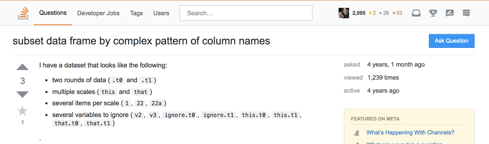
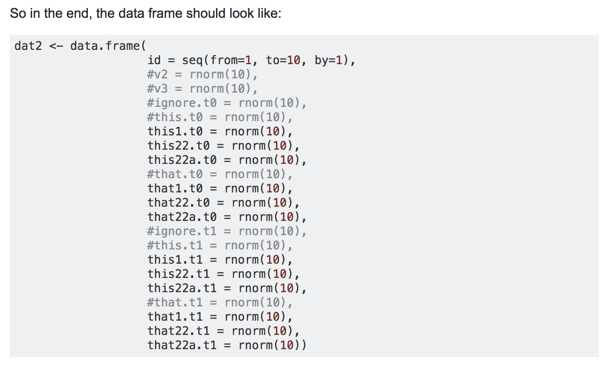
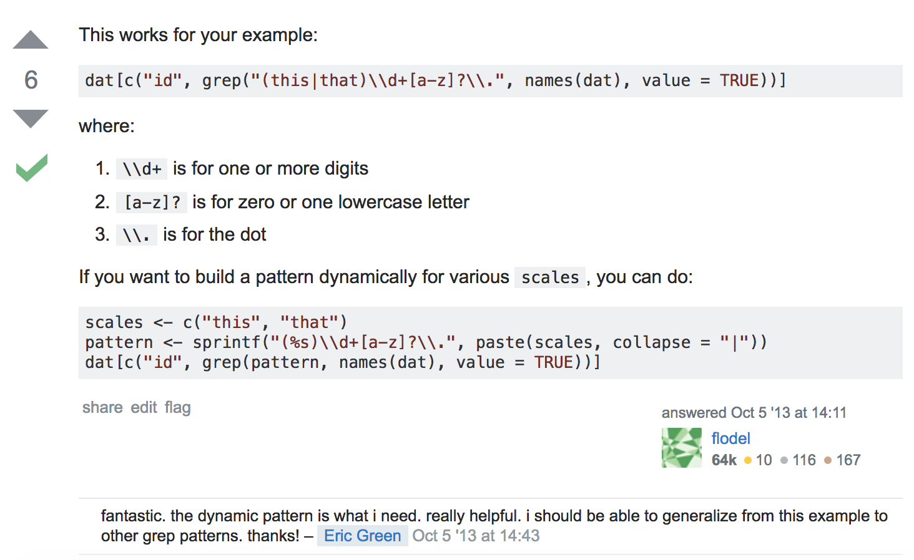
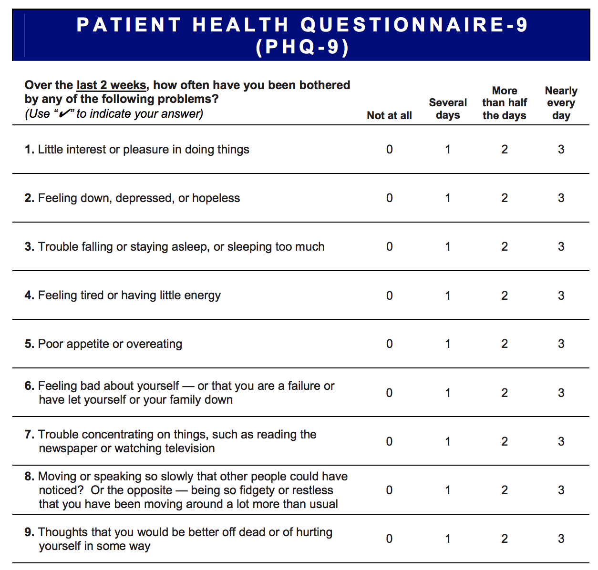

```{r setup, include=FALSE}
  library(knitr)
  knitr::opts_chunk$set(echo = TRUE)
  opts_knit$set(root.dir=normalizePath('../'))
  library(tidyverse)
```

## {data-background="w07-cover.jpg"}

<style type="text/css">
p { text-align: left; }
</style>

## Last week

We learned about relational data and how to combine tables using inner and outer joins:

function        behavior
--------        --------
`inner_join()`  Keeps observations that appear in `x` AND `y`
`left_join()`   Keeps keeps all observations in `x`
`right_join()`  Keeps all observations in `y`
`full_join()`   Keeps all observations in `x` OR `y`

## Last week

We used these functions to merge two rounds of individual-level panel data to data on higher-level units, including clinics and districts:

```{r loadCSV, include=FALSE}
  datR1 <- read.csv("input/r2d2-w06-r1.csv", stringsAsFactors = FALSE)
  datR2 <- read.csv("input/r2d2-w06-r2.csv", stringsAsFactors = FALSE)
  clinics <- read.csv("input/r2d2-w06-clinics.csv", stringsAsFactors = FALSE)
  districts <- read.csv("input/r2d2-w06-districts.csv", 
                        stringsAsFactors = FALSE)
```

```{r districts}
  datR1 %>%
    full_join(datR2, 
              by = "ID", 
              suffix = c(".r1", ".r2")) %>%
    left_join(clinics, by="clinicID") %>%
    left_join(districts, by="district")
```

## Objectives 

Today we'll learn about how to work with strings, factors, and dates. Some of today's examples come from @wickham2017. By the end of this session, you should be able to:

* Create and search strings using regex
* Create and plot factors
* Create and manipulate dates

## Login to Duke's Docker-ized version of RStudio Server

* Login to your instance by going to [https://vm-manage.oit.duke.edu/containers](https://vm-manage.oit.duke.edu/containers) and entering your NetID. 
* Click on Docker
* Click on RStudio
* When RStudio loads, restart the R session (`Ctrl/Cmd+Shift+F10`), clear the console (`Ctrl/Cmd+L`), and clear your workspace 

## Open your project

Is your project still open? If not, click on the project icon to load it. (Don't create a new one.)

<center>

</center>

## Download and open the template

Run the following code in your console. Change `products` to your preferred subfolder.

```{r, eval=FALSE}
  download.file("https://tinyurl.com/ya26uo6p", 
                destfile = "products/lab-w07.Rmd")
```

## Start by loading a few packages

We'll need:

```{r, results="hide", message=FALSE}
  library(tidyverse)
  library(stringr)
  library(forcats)
  library(lubridate)
  library(likert)
```

These are all members of the `tidyverse`, but not all are loaded automatically when you load `tidyverse`.

## Strings {data-background=#f4c842}

<center>

</center>

## A String

```{r}
  myString1 <- "Hi, this is a string."
  myString2 <- 'Single quotes work, too.'
  myString3 <- 'You need single quotes when "quoting" within a string.'
```

## Remember to close quotes

```{r, eval=FALSE}
  myString4 <- "I feel like I am forgetting something.
```

Just hit `esc` when this happens to you. RStudio will help you realize your errors.

## Character vectors

Use `c()` to create a character vector:

```{r}
  aVariable <- c("yes", "no", "no", "yes", "yes")
  aVariable
```

## Fun with strings

Count characters in a string:

```{r}
  aVariable
  str_length(aVariable)
```

When applied to a character vector like this, `str_length()` returns the length of each string in the vector.

## Combine strings

Default is to combine with no separation (i.e., `sep=""`):

```{r}
  str_c(myString1, myString2, myString3)
```

Separate with a space:

```{r}
  str_c(myString1, myString2, myString3, 
        sep=" ")
```

## Subset

```{r}
  x <- c("yr2008", "yr2009", "yr2010")
  str_sub(x, 3, 6) 
  str_sub(x, -4, -1) # count backwards from right
```

## Change case

```{r}
  case <- c("Here", "ARE", "somE", "words")
  str_to_lower(case)
  str_to_upper(case)
  str_to_title(case)
```

## Trim whitespace

```{r}
  white <- c("1", "2", " 3", "4 ") 
  str_trim(white)
```

## Match patterns with regular expressions

* Regular expressions (regex) is a sequence of characters that define a search pattern
* When you search `disclos*`, `*` is a wildcard that lets you search the root `disclos` and its combinations, like "disclose", "disclosed", and "disclosure"
* Guaranteed to look like gibberish to you at first

## Exact matches

```{r}
  x <- c("scale1.item1", "scale1.item2", "scale2.item1")
  str_view(x, "item")
```

## `.` matches any character

```{r}
  x <- c("scale1.item1", "scale1.item2", "scale2.item1")
  str_view(x, "item.") # next character to right
```

## Escape special characters

`.` means any character, so to match for a literal ".", we have to "escape" it with `\\`.

```{r}
  x <- c("scale1.item1", "scale1.item2", "scale2.item1")
  str_view(x, "\\.item") # match ".item"
```

## Match the beginning

```{r}
  x <- c("hiv", "hiv+", "hiv-", "hiv positive", "virus")
  str_view(x, "^h")  # from beginning
```

## Match the end

```{r}
  x <- c("hiv", "hiv+", "hiv-", "hiv positive")
  str_view(x, "v$")  # from end
```

## A complete match

```{r}
  x <- c("hiv", "hiv+", "hiv-", "hiv positive")
  str_view(x, "^hiv$") 
```

## Match a digit `\d`

```{r}
  x <- c("scale1.item1", "scale1.item2", "scale2.item1", "scales")
  str_view(x, "scale\\d")
```

## Match whitespace `\s`

```{r}
  x <- c("hiv", "hiv+", "hiv-", "hiv positive")
  str_view(x, "hiv\\s") 
```

## Matches a letter `[a]`

```{r}
  x <- c("scale1.item1a", "scale1.item1b", "scale1.item1c", "scales")
  str_view(x, "item\\d[ab]")
```

## Matches anything except letter `[^a]`

```{r}
  x <- c("scale1.item1a", "scale1.item1b", "scale1.item1c", "scales")
  str_view(x, "item\\d[^a]")
```

## Just gets more complicated (and powerful)

<center>

</center>

## My toy dataset

```{r}
  dat <- data.frame(id = seq(from=1, to=10, by=1),
                    v2 = rnorm(10),
                    v3 = rnorm(10),
                    ignore.t0 = rnorm(10),
                    this.t0 = rnorm(10),
                    this1.t0 = rnorm(10),
                    this22.t0 = rnorm(10),
                    this22a.t0 = rnorm(10),
                    that.t0 = rnorm(10),
                    that1.t0 = rnorm(10),
                    that22.t0 = rnorm(10),
                    that22a.t0 = rnorm(10),
                    ignore.t1 = rnorm(10),
                    this.t1 = rnorm(10),
                    this1.t1 = rnorm(10),
                    this22.t1 = rnorm(10),
                    this22a.t1 = rnorm(10),
                    that.t1 = rnorm(10),
                    that1.t1 = rnorm(10),
                    that22.t1 = rnorm(10),
                    that22a.t1 = rnorm(10))
```

## My toy dataset

Variable names: 

```{r}
  names(dat)
```

## What I wanted

I want to subset the data frame to include id and only columns with:

* the scale name (this or that) AND
* a number (1.) OR a number and letter (22a.) before the period

<center>

</center>

## The answer

<center>

</center>

## The tidyverse way

```{r}
  dat2 <- 
  dat %>%
    select(matches("(this|that)\\d+[a-z]?\\.", vars=names(dat)))
  glimpse(dat2)
```

## A closer look

`"(this|that)\\d+[a-z]?\\."`

* `(this|that)`: "this" OR "that"
* `\\d`: followed by 1 or more digits
* `[a-z]?`: followed by zero or 1 (`?`) lowercase letter a-z (`[a-z`])
* `\\.`: followed by a dot

```{r echo=FALSE}
  names(dat2)
```

## Detect matches

Return a logical vector of matches:

```{r}
  names(dat)
```

```{r}
  str_detect(names(dat), "(this|that)\\d+[a-z]?\\.")
  sum(str_detect(names(dat), "(this|that)\\d+[a-z]?\\.")) # how many
```

## Take the inverse

Negate with `!`:

```{r}
  names(dat)
```

```{r}
  !str_detect(names(dat), "(this|that)\\d+[a-z]?\\.")
  sum(!str_detect(names(dat), "(this|that)\\d+[a-z]?\\.")) # how many
```

## Match and replace

```{r}
  x <- c("always", "sometimes", "always", "never", "often")
  str_replace_all(x, c("always"="almost always"))
```

## Factors {data-background=#f4c842}

<center>

</center>

## Factors are `forcats`

For categorical variables:

* binary (0/1, yes/no)
* nominal (cow, pig, sheep)
* ordinal (small, medium, large)

## Strings hide errors and only sort alphabetical

```{r}
  x1 <- c("Dec", "Apr", "Jan", "Mar", "Jan", NA)
  table(x1)
  x2 <- c("Dec", "Apr", "Jam", "Mar", "Jan", NA)
  table(x2)
```

```{r}
  sort(x1)
```

## Factors don't have these problems

```{r}
  month_levels <- c(
    "Jan", "Feb", "Mar", "Apr", "May", "Jun", 
    "Jul", "Aug", "Sep", "Oct", "Nov", "Dec"
  )
  y1 <- factor(x1, levels = month_levels)
  table(y1)
```

```{r}
  sort(y1)
```

## Watch out for NAs

```{r}
  table(y1, useNA = "always")
```

## Factors in the disclosure study

```{r, include=FALSE}
  download.file("https://www.dropbox.com/s/848ze40t8ruv613/r2d2-w07.csv?dl=1", 
                destfile = "input/r2d2-w07.csv")
  datR1 <- read.csv("input/r2d2-w07.csv", stringsAsFactors = FALSE)
```

<center>

</center>

## PHQ9

```{r}
  glimpse(datR1)
```

## Convert to factor

```{r}
  datR1 %>%
    select(PHQ91.r1) %>%
    mutate(PHQ91.r1 = factor(PHQ91.r1,
                             levels=c(0, 1, 2, 3),
                             labels = c("not at all", 
                                        "several days",
                                        "more than half the days",
                                        "nearly every day"))) %>%
    table()
```

## Convert all PHQ variables to factor

```{r}
  datR1 %>%
    select(contains("PHQ9")) %>%
    mutate_at(vars(contains("PHQ9")), 
              function(x) factor(x, 
                                 levels=c(0, 1, 2, 3),
                                 labels = c("not at all", 
                                            "several days",
                                            "more than half the days",
                                            "nearly every day")))
```

## Create a new variable `gender`

Give it levels "male" and "female"

## Create a new variable `gender`

```{r}
  datR1 %>%
    mutate(gender = factor(p.female.r1,
                           levels=c(0, 1),
                           labels = c("male", 
                                      "female"))) %>%
    select("gender") %>%
    table()
```

## Calculate response frequencies

```{r}
  datR1 %>%
    select(contains("PHQ9")) %>%
    mutate_at(vars(contains("PHQ9")), 
              function(x) factor(x, 
                                 levels=c(0, 1, 2, 3),
                                 labels = c("not at all", 
                                            "several days",
                                            "more than half the days",
                                            "nearly every day"))) %>%
    likert() # %>% plot()
```

## Plot response frequencies {.reveal}

```{r, echo=FALSE}
  datR1 %>%
    select(contains("PHQ9")) %>%
    mutate_at(vars(contains("PHQ9")), 
              function(x) factor(x, 
                                 levels=c(0, 1, 2, 3),
                                 labels = c("not at all", 
                                            "several days",
                                            "more than half the days",
                                            "nearly every day"))) %>%
    likert() %>%
    plot()
```

## Create a new variable `disclosed`

Give it levels "disclosed" and "non-disclosed". First we need to convert all NA to 0. (hint: `mutate` and `case_when`)

## Create a new variable `disclosed`

```{r}
  datR1 %>%
    mutate(doesKnow16d.r1 = case_when(is.na(doesKnow16d.r1) ~ 0,
                                      doesKnow16d.r1==1 ~ 1,
                                      doesKnow16d.r1==0 ~ 0)) %>%
    mutate(disclosed = factor(doesKnow16d.r1,
                              levels=c(0, 1),
                              labels = c("non-disclosed", 
                                         "disclosed"))) %>%
    select("disclosed") %>%
    table()
```

## Plot by group

```{r, }
  grouped1 <- 
  datR1 %>%
    mutate(doesKnow16d.r1 = case_when(is.na(doesKnow16d.r1) ~ 0,
                                      doesKnow16d.r1==1 ~ 1,
                                      doesKnow16d.r1==0 ~ 0)) %>%
    mutate(disclosed = factor(doesKnow16d.r1,
                              levels=c(0, 1),
                              labels = c("non-disclosed", 
                                         "disclosed"))) %>%
    mutate_at(vars(contains("PHQ9")), 
              function(x) factor(x, 
                                 levels=c(0, 1, 2, 3),
                                 labels = c("not at all", 
                                            "several days",
                                            "more than half the days",
                                            "nearly every day"))) 
  grouped2 <- grouped1
  grouped1 %>%
    select(contains("PHQ9")) %>%
    likert(grouping=grouped1$disclosed) #%>% plot()
```

## Plot by group

```{r, echo=FALSE}
  grouped1 <- 
  datR1 %>%
    mutate(doesKnow16d.r1 = case_when(is.na(doesKnow16d.r1) ~ 0,
                                      doesKnow16d.r1==1 ~ 1,
                                      doesKnow16d.r1==0 ~ 0)) %>%
    mutate(disclosed = factor(doesKnow16d.r1,
                              levels=c(0, 1),
                              labels = c("non-disclosed", 
                                         "disclosed"))) %>%
    mutate_at(vars(contains("PHQ9")), 
              function(x) factor(x, 
                                 levels=c(0, 1, 2, 3),
                                 labels = c("not at all", 
                                            "several days",
                                            "more than half the days",
                                            "nearly every day"))) 
  grouped2 <- grouped1
  grouped1 %>%
    select(contains("PHQ9")) %>%
    likert(grouping=grouped1$disclosed) %>% 
    plot()
```

## Dates {data-background=#f4c842}

<center>

</center>

## Get the date and time

```{r}
  now()
  now(tz="Africa/Harare")
  today()
```
Run `OlsonNames()` for timezones

## Create dates from strings

```{r}
  ymd("2017-01-31")
  mdy("January 31st, 2017")
  dmy("31-Jan-2017")
  ymd_hms("2017-01-31 20:11:59")
  mdy_hm("01/31/2017 08:01")
```

## Get components

```{r}
  year(now())
  month(now())
  month(now(), label = TRUE)
  mday(now())
  wday(now())
  wday(now(), label = TRUE, abbr = FALSE)
  yday(now())
  wday(now())
```

## Durations

```{r}
  start <- ymd("2000-01-01")
  inTheYear2000 <- today()-start
  inTheYear2000
```

## Periods

```{r}
  start
  start + days(4)
  start + weeks(9)
```

## Disclosure example

Create a variable that represents the number of days between the start of the survey, June 27, 2016, and the date of disclosure (fake data).

## Days since disclosure at survey launch

```{r}
  launch <- ymd("2016-06-27")
  datR1 %>%
    mutate(days = launch - mdy(p.disclosureDate.r1))
```

## Get the mean number of days since disclosure

```{r}
  launch <- ymd("2016-06-27")
  datR1 %>%
    mutate(days = launch - mdy(p.disclosureDate.r1)) %>%
    summarise(meanDays = mean(days, na.rm=TRUE))
```

## References

