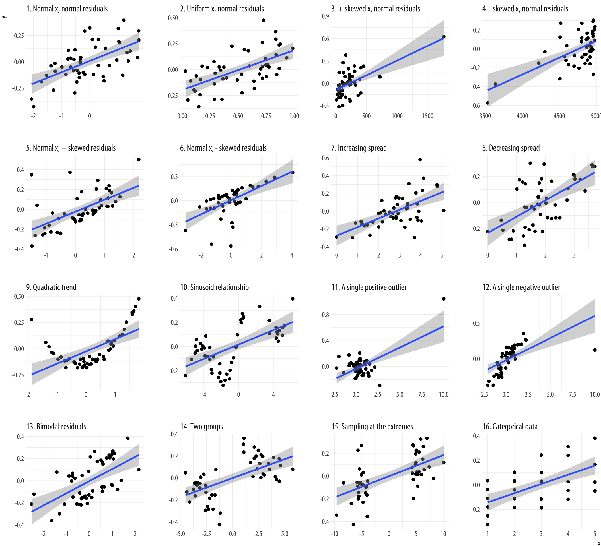
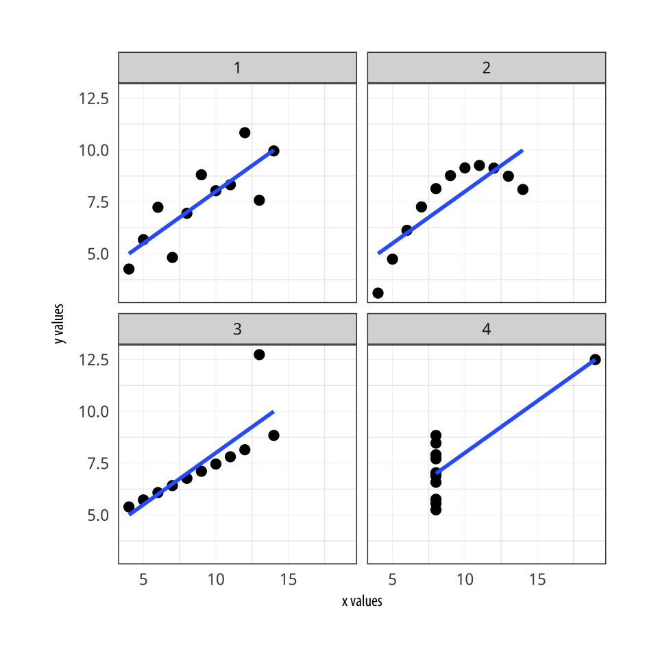
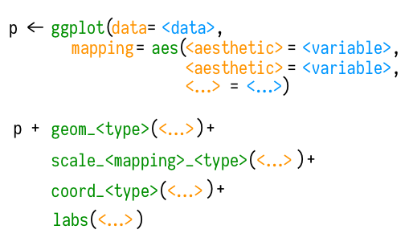

```{r setup, include=FALSE}
  library(knitr)
  knitr::opts_chunk$set(echo = TRUE)
  opts_knit$set(root.dir=normalizePath('../'))
  library(tidyverse)
```

## {data-background="w08-cover.jpg"}

<style type="text/css">
p { text-align: left; }
</style>

## Last week

We learned about working with strings, factors, and dates:

<center>

</center>

## Objectives 

Today we'll learn about how to visualize data. Some of today's examples come from @healy2017. By the end of this session, you should be able to:

* Describe the main arguments of a `ggplot()` call
* Map plot aesthetics to variables
* Style plots by color, fill, and shape
* Facet plots to make small multiples
* Set the theme and add labels 

## Login to Duke's Docker-ized version of RStudio Server

* Login to your instance by going to [https://vm-manage.oit.duke.edu/containers](https://vm-manage.oit.duke.edu/containers) and entering your NetID. 
* Click on Docker
* Click on RStudio
* When RStudio loads, restart the R session (`Ctrl/Cmd+Shift+F10`), clear the console (`Ctrl/Cmd+L`), and clear your workspace 

## Open your project

Is your project still open? If not, click on the project icon to load it. (Don't create a new one.)

<center>

</center>

## Start by loading a few packages

We'll need:

```{r, results="hide", message=FALSE}
  library(tidyverse)
  library(gapminder)
```

## Know your audience

* When you are creating plots during data inspection, cleaning, and exploration, you should emphasize speed and utility. Often you have an audience of 1.
* When you need to share output with co-authors, save yourself time in the long run by adding titles, labels, and minimal notes.
* When you are ready to share your work externally, expect to spend even more time creating publication-quality graphics. Remember, every figure + caption should be able to stand on its own without supporting details in the text.

## Exploratory data analysis

* EDA is an iterative process of asking questions about your data, searching for these answers through data visualization, transformation, and modelling, and then refining your questions [@wickham2017].
* EDA starts with data inspection and cleaning, but extends to a substantive exploration of data questions.
* @wickham2017 and @healy2017 both emphasize the importance of looking at your data to really understand what you have.

## Look at your data (*r*=0.6)

<center>

</center>

## Anscombe's quartet

Four datasets with nearly identical descriptive stats.

<center>

</center>

## Data Saurus

<center>

</center>

By Alberto Cairo. Get as an R package [`datasauRus`](https://github.com/stephlocke/datasauRus).

## Ask questions

@wickham2017 suggest the following EDA questions:  

* What type of variation occurs within my variables? (distributions)
* What type of covariation occurs between my variables? (associations)

## Categorical

If you have categorical data, start with a bar chart to summarize the distribution of values.

```{r, echo=FALSE, fig.height=5}
ggplot(data = diamonds) +
  geom_bar(mapping = aes(x = cut))
```

## Continuous

If you have continuous data, try a histogram.

```{r, echo=FALSE, fig.height=5}
ggplot(data = diamonds) +
  geom_histogram(mapping = aes(x = carat), binwidth = 0.5)
```

## A quick plot

Sometimes the fastest plot is a base R plot. 

```{r, fig.height=5}
  hist(diamonds$carat)
```

## Some fine tuning

```{r, fig.height=4}
  hist(diamonds$carat, 
       main="Histogram of carat size", 
       xlab="Carat size", 
       border="black", 
       col="red",
       las=1, 
       breaks=10)
```

## The `ggplot()` way

```{r, echo=FALSE, fig.height=5}
  ggplot(data = diamonds) +
    geom_histogram(mapping = aes(x = carat), binwidth = 0.5)
```

## Grammar of graphics

* `ggplot` is a tidyverse package by Hadley Wickham that implements Wilkinson's [*Grammar of Graphics*](http://amzn.to/2zLtZTW), a helpful approach for thinking about the components of an effective visualization of data.
* In this session we will focus on Wickham's implementation of this "gg" idea in his package `ggplot`.
* For more background on visualization principles and what makes a good plot, see @healy2017 for a nice overview. See also work by William Cleveland, such as [*The Elements of Graphing Data*](http://amzn.to/2APHUbt).

## The `ggplot` way [@healy2017]

<center>

</center>

## The `ggplot` way [@healy2017]

<center>

</center>

## Start by defining the `data`

This line tells `ggplot()` which dataset to use and produces a blank plot.

```{r, fig.height=4}
  ggplot(data = gapminder)
```

## Layering

For convenience, we're going to assign each step to an object called `p`. You can call it whatever you want. The key idea is that we create a base plot `p` and add to it in each step. So here, `p` is just an empty plot. If you want to see the result, you have to print `p`.

```{r, fig.show='hide'}
  p <- ggplot(data = gapminder)
  p
```

## Inspect the data

```{r}
  glimpse(gapminder)
```

## Declare `data` and `mapping`

The first two `ggplot()` arguments are `data` and `mapping`. We'll drop the `data=` and `mapping=` labels from here out. 

```{r}
  p <- ggplot(data = gapminder,
            mapping = aes(x = gdpPercap,
                          y = lifeExp))
  p <- ggplot(gapminder, 
              aes(x = gdpPercap, 
                  y = lifeExp)) # same thing
```

## The `aes()` function

* The `mapping` argument calls for aesthetic mappings of variables to plot elements. 
* Essentially, with `aes()` you tell `ggplot()` which variable from the dataset should map to the x-axis, and which should map to the y-axis.
* Here, we are mapping two variables from the dataset `gapminder`: `gdpPercap` goes to the x-axis, while `lifeExp` goes to the y-axis.

```{r}
  p <- ggplot(gapminder, aes(x = gdpPercap, y = lifeExp))
```

## What do we have so far?

Not much. We've just told `ggplot` to use the `gapminder` dataset and to map two variables, but we have not specified the type of plot we want. 

```{r, fig.height=3.75}
  p
```

## Specify a `geom()`

Use the `+` sign to add the next layer to this plot—a `geom()`! In this example, we add `geom_point()`, the points geom.

```{r, fig.height=3, message=FALSE}
  p + geom_point()  # not assigning to p on purpose
```

## {data-background-iframe="http://ggplot2.tidyverse.org/reference/index.html#section-layer-geoms"}

## Fine tune `geom_point()`

Check out the help file for your `geom` to learn more about use or review the great reference material on tidyverse.org: http://ggplot2.tidyverse.org/reference/geom_point.html

```{r}
  ?geom_point # learn about arguments
```

## Pick a different geom

This geom calculates a smoothed line and shades the standard error. Check out the arguments to `geom_smooth()` to tinker with the smoothing function used.

```{r, message=FALSE, fig.height=3}
  p + geom_smooth()
```

## Add both geoms

```{r, message=FALSE, fig.height=4}
  p + geom_point() + geom_smooth(method="lm") # change method
```

## Rescale the x-axis

```{r message=FALSE, fig.height=4}
  p + geom_point() + geom_smooth() + scale_x_log10()
```

## {data-background-iframe="http://ggplot2.tidyverse.org/reference/index.html#section-scales"}

## Add some scale labels

```{r message=FALSE, fig.height=4}
  p + geom_point() + geom_smooth() + 
      scale_x_log10(labels = scales::dollar)
```

## Change the look

```{r message=FALSE, fig.height=3}
  p <- p + geom_point(color="purple",
                      alpha = 0.3, # color transparency
                      size=2) +
           geom_smooth(method="loess", 
                       color="#FCF221") + # htmlcolorcodes.com
           scale_x_log10(labels = scales::dollar)
  p
```

## Add some labels

```{r, message=FALSE, fig.height=3}
  p <- p + labs(x = "GDP Per Capita", 
                y = "Life Expectancy in Years",
                title = "Economic Growth and Life Expectancy",
                subtitle = "Data points are country-years",
                caption = "Source: Gapminder.")
  p
```

## Change the theme

```{r, message=FALSE, fig.height=4}
  p + theme_minimal()
```

## {data-background-iframe="http://ggplot2.tidyverse.org/reference/index.html#section-themes"}

## Map aesthetics to variables

For instance, maybe instead of making all the points "purple", we want to color the points by values in the variable `continent`.

```{r}
  p <- ggplot(gapminder,
              aes(x = gdpPercap,
                  y = lifeExp,
                  color = continent))
```

## Adding the geoms

```{r, fig.height=4}
  p + geom_point() +
      geom_smooth(method='loess') +
      scale_x_log10()
```

## Can also map `shape` to point values

```{r, fig.height=3}
  ggplot(gapminder,
         aes(x = gdpPercap,
             y = lifeExp,
             shape = continent)) + # changed from color
         geom_point() +
         geom_smooth(method='loess') +
         scale_x_log10()
```

## Map `fill` to se

```{r}
  p <- ggplot(gapminder,
                aes(x = gdpPercap,
                    y = lifeExp,
                    color = continent,
                    fill = continent))
```

## Adding the geoms

```{r, fig.height=4}
  p + geom_point() +
      geom_smooth(method='loess') +
      scale_x_log10()
```

## Map aesthetics per geom

```{r, fig.height=3}
  p <- ggplot(gapminder,
              aes(x = gdpPercap,
                  y = lifeExp))
  p + geom_point(aes(color = continent),
                 alpha=0.6,
                 size=1) +
      geom_smooth(method='loess') + # just 1 line
      scale_x_log10()
```

## Small multiples

The group trends are hard to see. Let's try faceting by `continent` to make a series of "small multiples". First we need to get back to our basic plot defining point and line color:

```{r}
  p <- p + geom_point(color="purple",
                      alpha = 0.3, 
                      size=2) +
           geom_smooth(method="loess", 
                       color="#FCF221") +
           scale_x_log10(labels = scales::dollar)
```

## `facet_wrap()`

```{r, fig.height=4}
  p + facet_wrap(~ continent)
```

## Make it nice

```{r, fig.height=4}
  p + facet_wrap(~ continent, ncol = 5) +
      labs(x = "GDP Per Capita", 
           y = "Life Expectancy in Years",
           title = "Economic Growth and Life Expectancy on Five Continents",
           subtitle = "Data points are country-years",
           caption = "Source: Gapminder.") +
      theme_minimal() +
      theme(axis.text.x=element_text(size=6))
```


## References

