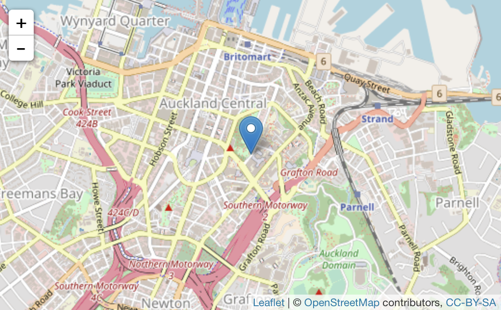
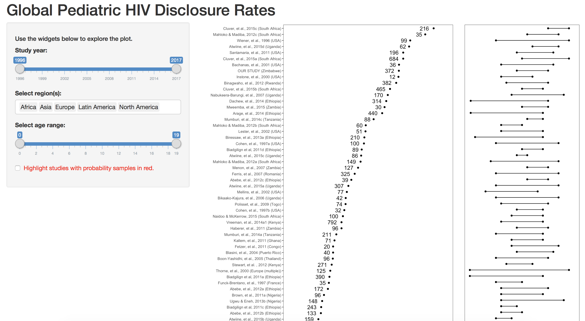

```{r setup, include=FALSE}
  library(knitr)
  knitr::opts_chunk$set(echo = TRUE)
  opts_knit$set(root.dir=normalizePath('../'))
  library(tidyverse)
  library(gapminder)
```

## {data-background="w09-cover.jpg"}

<style type="text/css">
p { text-align: left; }
</style>

## Last week

We learned about how to visualize data using base R and `ggplot()`:

```{r, fig.height=4, echo=FALSE}
  p <- ggplot(gapminder,
              aes(x = gdpPercap,
                  y = lifeExp))
  p <- p + geom_point(color="purple",
                      alpha = 0.3, 
                      size=2) +
           geom_smooth(method="loess", 
                       color="#FCF221") +
           scale_x_log10(labels = scales::dollar)
  p + facet_wrap(~ continent, ncol = 5) +
      labs(x = "GDP Per Capita", 
           y = "Life Expectancy in Years",
           title = "Economic Growth and Life Expectancy on Five Continents",
           subtitle = "Data points are country-years",
           caption = "Source: Gapminder.") +
      theme_minimal() +
      theme(axis.text.x=element_text(size=6))
```

## Declare `data` and `mapping`

Recall that the first two `ggplot()` arguments are `data` and `mapping`. 

```{r}
  library(tidyverse)
  library(gapminder)
  p <- ggplot(gapminder, 
              aes(x = gdpPercap, 
                  y = lifeExp))
```

## Specify a `geom()`

We used the `+` sign to add the next layer to this plot—a `geom()`! In this example, we added `geom_point()`, the points geom.

```{r, fig.height=3, message=FALSE}
  p + geom_point()
```

## Add a second geom and rescale

```{r, message=FALSE, fig.height=4}
  p + geom_point() + geom_smooth() + 
      scale_x_log10(labels = scales::dollar)
```

## Change the look

```{r message=FALSE, fig.height=3}
  p <- p + geom_point(color="purple",
                      alpha = 0.3, # color transparency
                      size=2) +
           geom_smooth(method="loess", 
                       color="#FCF221") + # htmlcolorcodes.com
           scale_x_log10(labels = scales::dollar)
  p
```

## Add some labels

```{r, message=FALSE, fig.height=3}
  p <- p + labs(x = "GDP Per Capita", 
                y = "Life Expectancy in Years",
                title = "Economic Growth and Life Expectancy",
                subtitle = "Data points are country-years",
                caption = "Source: Gapminder.")
  p
```

## Change the theme

```{r, message=FALSE, fig.height=4}
  p + theme_minimal()
```

## Objectives 

Today we'll learn how to create interactive visualizations. By the end of this session, you should be able to:

* Use html widgets
* Create a shiny app

## Login to Duke's Docker-ized version of RStudio Server

* Login to your instance by going to [https://vm-manage.oit.duke.edu/containers](https://vm-manage.oit.duke.edu/containers) and entering your NetID. 
* Click on Docker
* Click on RStudio
* When RStudio loads, restart the R session (`Ctrl/Cmd+Shift+F10`), clear the console (`Ctrl/Cmd+L`), and clear your workspace 

## Open your project

Is your project still open? If not, click on the project icon to load it. (Don't create a new one.)

<center>

</center>

## Start by loading a few packages

We'll need:

```{r, results="hide", message=FALSE}
  library(tidyverse)
  library(leaflet)
  library(dygraphs)
  library(plotly)
  library(magrittr)
  library(d3heatmap)
  library(shiny)
  library(grid)
  library(useful)
```

## `leaflet`

```{r, fig.height=4, eval=FALSE}
  m <- 
  leaflet() %>%
    addTiles() %>%  # Add default OpenStreetMap map tiles
    addMarkers(lng=174.768, lat=-36.852, 
               popup="The birthplace of R")
  m  # Print the map
```

<center>

</center>


## `dygraph`

```{r, fig.height=4}
  dygraph(nhtemp, main = "New Haven Temperatures") %>% 
    dyRangeSelector(dateWindow = c("1920-01-01", "1960-01-01"))
```

## `plotly`

```{r, message=FALSE}
  p <- ggplot(diamonds, aes(x = cut, fill = clarity)) +
              geom_bar(position = "dodge")
  ggplotly(p)
```

## `d3heatmap`

```{r}
  d3heatmap(mtcars, scale="column", colors="Blues")
```

## {data-background-video="../img/shiny.mp4"}

## Shiny app

A shiny app consists of a user interface (`ui`) object, a `server` function, and a call to `shinyApp()`.

```{r, eval=FALSE}
  library(shiny)

  ui <- ...      # layout and appearance
  
  server <- ...  # crunch numbers, draw plots
  
  shinyApp(ui = ui, server = server)
```

## `app.R`

Create a folder called `myApp`. Then run the following code in your console.

```{r, eval=FALSE}
  download.file("https://tinyurl.com/yc4lxjql", 
                destfile = "myApp/app.R")
```

## UI: `fluidPage()`

`?fluidPage`: "A fluid page layout consists of rows which in turn include columns."

```{r, eval=FALSE}
  ui <- fluidPage(
```

## UI: What appears on the page?

Could be a title, a sidebar of inputs, and a main panel of output.

```{r, eval=FALSE}
  titlePanel("Hello Shiny!"),
  sidebarLayout(...),
  mainPanel(...)
```

## UI: Input

Notice there is an input field called "bins".

```{r, eval=FALSE}
# Sidebar layout with input and output definitions ----
  sidebarLayout(

    # Sidebar panel for inputs ----
    sidebarPanel(

      # Input: Slider for the number of bins ----
      sliderInput(inputId = "bins",
                  label = "Number of bins:",
                  min = 1,
                  max = 50,
                  value = 30)

    )
```

## UI: Output

```{r, eval=FALSE}
  mainPanel(

      # Output: Histogram ----
      plotOutput(outputId = "distPlot")

    )
```

## Server

```{r, eval=FALSE}
# Define server logic required to draw a histogram ----
  server <- function(input, output) {...}

  
```

## Server: Output

Wrapped in `renderPlot()` function to make reactive. When input updated, output updated.

```{r, eval=FALSE}
  output$distPlot <- renderPlot({
  
      x    <- faithful$waiting
      bins <- seq(min(x), max(x), length.out = input$bins + 1)
  
      hist(x, breaks = bins, col = "#75AADB", border = "white",
           xlab = "Waiting time to next eruption (in mins)",
           main = "Histogram of waiting times")
  
      })
  
  }
```

## Server: Input

Name of input slider defined in `ui`: `input$bins`.

```{r, eval=FALSE}
  output$distPlot <- renderPlot({
  
      x    <- faithful$waiting
      bins <- seq(min(x), max(x), length.out = input$bins + 1)
  
      hist(x, breaks = bins, col = "#75AADB", border = "white",
           xlab = "Waiting time to next eruption (in mins)",
           main = "Histogram of waiting times")
  
      })
  
  }
```

## Let's make this into a shiny app

```{r, echo=FALSE, eval=FALSE}
  download.file("https://www.dropbox.com/s/w0j0go3qck56x17/datPct.RData?dl=1", 
                destfile = "lit-app/data/datPct.RData")
```

```{r, echo=FALSE, message=FALSE, warning=FALSE, results="hide"}
  load("lit-app/data/datPct.RData")
  
# study x pct disclosed
  studyDisclosed <-
    datPct %>%
    ggplot(., aes(x=pctDisclosed, y=reorder(as.character(name), 
                                            pctDisclosed), 
                  color=as.factor(psam), 
                  shape=as.factor(psam), 
                  label=sampleSize)) +
    geom_point() +
    geom_text(size=3, hjust=1.5) +
    xlim(-10,100) +
    labs(x="Percent Disclosed",
         y="") +
    theme_bw() +
    scale_color_manual(values=c("0"= "red",
                                "1" = "gray")) +
    scale_shape_manual(values=c(19,1)) +
    theme(panel.grid=element_blank()) +
    guides(color=FALSE) +
    guides(shape=FALSE)
  
  cairo_pdf(paste("output/figures/studyDisclosed_iedsfb", "pdf", sep="."),
            height=12,
            width=6)
  print(studyDisclosed)
  dev.off()

# study x age range
  studyAgeRange <-
    datPct %>%
    select(minAge, maxAge, name, pctDisclosed, ours, psam) %>%
    gather(., key, value, -name, -pctDisclosed, -ours, -psam) %>%
    filter(!is.na(value)) %>%
    ggplot(., aes(x=value, y=reorder(as.character(name), pctDisclosed), 
                  group=name, shape=as.factor(psam), color=as.factor(psam))) +
    geom_line() +
    geom_point() +
    scale_color_manual(values=c("0"= "red",
                                "1" = "gray")) +
    scale_shape_manual(values=c(19,1)) +
    guides(shape=FALSE) +
    guides(color=FALSE) +
    labs(x="Study Age Range",
         y="") +
    xlim(0,20) +
    theme_bw() +
    theme(panel.grid=element_blank(),
          axis.text.y=element_blank(),
          axis.ticks.y=element_blank()) 
  
  cairo_pdf(paste("output/figures/studyAgeRange_iedsfb", "pdf", sep="."),
            height=12,
            width=2)
  print(studyAgeRange)
  dev.off()
  
  #png("output/figures/litFig_iedsfb.png")
  grid.newpage()
  pushViewport(viewport(layout=grid.layout(1,3)))
  print(studyDisclosed, vp=vplayout(1,1:2))
  print(studyAgeRange, vp=vplayout(1,3))
  #dev.off()
```

## Create some new folders in your working directory

* `lit-app`
* `lit-app/data`
* `output`
* `output/figures`

## Get the data

```{r, eval=FALSE}
  download.file("https://www.dropbox.com/s/w0j0go3qck56x17/datPct.RData?dl=1", 
                destfile = "lit-app/data/datPct.RData")
```

## Load the data

```{r}
  load("lit-app/data/datPct.RData")
```

## Percent disclosed by study

```{r, eval=FALSE}
  studyDisclosed <-
    datPct %>%
    ggplot(., aes(x=pctDisclosed, y=reorder(as.character(name), 
                                            pctDisclosed), 
                  color=as.factor(psam), 
                  shape=as.factor(psam), 
                  label=sampleSize)) +
    geom_point() +
    geom_text(size=3, hjust=1.5) +
    xlim(-10,100) +
    labs(x="Percent Disclosed",
         y="") +
    theme_bw() +
    scale_color_manual(values=c("0"= "red",
                                "1" = "gray")) +
    scale_shape_manual(values=c(19,1)) +
    theme(panel.grid=element_blank()) +
    guides(color=FALSE) +
    guides(shape=FALSE)
  
```

## Percent disclosed by study

```{r, echo=FALSE}
  studyDisclosed <-
    datPct %>%
    ggplot(., aes(x=pctDisclosed, y=reorder(as.character(name), 
                                            pctDisclosed), 
                  color=as.factor(psam), 
                  shape=as.factor(psam), 
                  label=sampleSize)) +
    geom_point() +
    geom_text(size=3, hjust=1.5) +
    xlim(-10,100) +
    labs(x="Percent Disclosed",
         y="") +
    theme_bw() +
    scale_color_manual(values=c("0"= "red",
                                "1" = "gray")) +
    scale_shape_manual(values=c(19,1)) +
    theme(panel.grid=element_blank()) +
    guides(color=FALSE) +
    guides(shape=FALSE)
  studyDisclosed
```

## Save this plot

```{r, results='hide'}
  cairo_pdf(paste("output/figures/studyDisclosed_iedsfb", "pdf", 
                  sep="."),
            height=12,
            width=6)
  print(studyDisclosed)
  dev.off()
```

## Age range by study

```{r, eval=FALSE}
  studyAgeRange <-
    datPct %>%
    select(minAge, maxAge, name, pctDisclosed, ours, psam) %>%
    gather(., key, value, -name, -pctDisclosed, -ours, -psam) %>%
    filter(!is.na(value)) %>%
    ggplot(., aes(x=value, y=reorder(as.character(name), 
                                     pctDisclosed), 
                  group=name, shape=as.factor(psam), 
                  color=as.factor(psam))) +
    geom_line() +
    geom_point() +
    scale_color_manual(values=c("0"= "red",
                                "1" = "gray")) +
    scale_shape_manual(values=c(19,1)) +
    guides(shape=FALSE) +
    guides(color=FALSE) +
    labs(x="Study Age Range",
         y="") +
    xlim(0,20) +
    theme_bw() +
    theme(panel.grid=element_blank(),
          axis.text.y=element_blank(),
          axis.ticks.y=element_blank()) 
```

## Age range by study

```{r, echo=FALSE}
  studyAgeRange <-
    datPct %>%
    select(minAge, maxAge, name, pctDisclosed, ours, psam) %>%
    gather(., key, value, -name, -pctDisclosed, -ours, -psam) %>%
    filter(!is.na(value)) %>%
    ggplot(., aes(x=value, y=reorder(as.character(name), 
                                     pctDisclosed), 
                  group=name, shape=as.factor(psam), 
                  color=as.factor(psam))) +
    geom_line() +
    geom_point() +
    scale_color_manual(values=c("0"= "red",
                                "1" = "gray")) +
    scale_shape_manual(values=c(19,1)) +
    guides(shape=FALSE) +
    guides(color=FALSE) +
    labs(x="Study Age Range",
         y="") +
    xlim(0,20) +
    theme_bw() +
    theme(panel.grid=element_blank(),
          axis.text.y=element_blank(),
          axis.ticks.y=element_blank()) 
  studyAgeRange
```

## Save plot

```{r}
  cairo_pdf(paste("output/figures/studyAgeRange_iedsfb", "pdf", 
                  sep="."),
            height=12,
            width=2)
  print(studyAgeRange)
  dev.off()
```

## Combine into one plot

```{r}
  #png("output/figures/litFig_iedsfb.png")
  grid.newpage()
  pushViewport(viewport(layout=grid.layout(1,3)))
  print(studyDisclosed, vp=vplayout(1,1:2))
  print(studyAgeRange, vp=vplayout(1,3))
  #dev.off()
```

## `app.R`

Run the following code in your console.

```{r, eval=FALSE}
    download.file("https://tinyurl.com/ybjbodwp", 
                destfile = "lit-app/app.R")
```

## Result

<center>

</center>

## References

