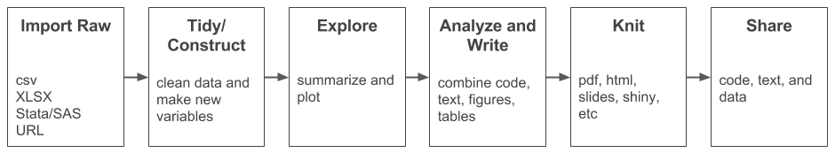

```{r setup, include=FALSE}
  library(knitr)
  knitr::opts_chunk$set(echo = TRUE)
  opts_knit$set(root.dir=normalizePath('../'))
  library(tidyverse)
  library(gapminder)
```

## {data-background="w10-cover.jpg"}

<style type="text/css">
p { text-align: left; }
</style>

## Last week

We reviewed how to create static plots using `ggplot()` and introduced interactive documents via html widgets and shiny apps.

<center>

</center>

## Objectives 

Today we'll learn how to create reproducible documents. By the end of this session, you should be able to:

* Create a Rmarkdown file
* Modify chunk options
* Write inline code
* Include references
* Reference tables and figures

## Login to Duke's Docker-ized version of RStudio Server

* Login to your instance by going to [https://vm-manage.oit.duke.edu/containers](https://vm-manage.oit.duke.edu/containers) and entering your NetID. 
* Click on Docker
* Click on RStudio
* When RStudio loads, restart the R session (`Ctrl/Cmd+Shift+F10`), clear the console (`Ctrl/Cmd+L`), and clear your workspace 

## Open your project

Is your project still open? If not, click on the project icon to load it. (Don't create a new one.)

<center>

</center>

## Remember This?

<center>

</center>

## {data-background-iframe="http://rmarkdown.rstudio.com/"}

## A Basic Example

Create a new RMarkdown HTML file

<center>

</center>

## Default template

<center>

</center>

## Knit to HTML/PDF 

Hit the `knit` button to knit to HTML. Then replace `output: html_document` in the YAML with `output: pdf_document` and knit again.

## {data-background-iframe="https://yihui.name/knitr/"}

## Chunk options

Change options chunk-by-chunk, or set global options:

* `eval=`: `FALSE` if you do not want R to run (evaluate) the chunk
* `echo=`: `FALSE` if you do not want to print the actual code in your document
* `include`: `FALSE` if you want to suppress code AND output in your document (i.e., run only)
* `warning`: `FALSE` if you want to suppress warning messages
* `message`: `FALSE` if you want to suppress other messages
* `cache`: `TRUE` if you want to store the results of big processing chunks so R does not re-run every time you knit

## Chunk options

To set global options, add to the setup chunk:

```{r, eval=FALSE}
# knitr::opts_chunk$set(echo = TRUE) # original
  knitr::opts_chunk$set(echo = TRUE, cache = TRUE, warning = FALSE)
```

To set options by chunk, add a comma after your chunk name (names are optional):

```{r, eval=FALSE}
  {r cars, echo = TRUE, cache = TRUE, warning = FALSE}
  {r, echo = TRUE, cache = TRUE, warning = FALSE}
```

## In-line code

You can create objects in chunks and refer to these objects in the markdown. Try this: In the chunk `cars`, create an object called `meanSpeed`:

```{r, eval=FALSE}
  meanSpeed <- mean(cars$speed)
```

Then below and outside of the chunk (not inside as shown here), write:

```{r, eval=FALSE}
The mean speed is `r meanSpeed`.
```

The important part is to surround your code with two backticks and begin the expression with `r` and a space.

## In-line code

Alternatively, you can skip the object step and write the code in-line. (Remember: write this OUTSIDE of the chunk)

```{r, eval=FALSE, fig.}
The mean speed is `r meanSpeed`.
The mean speed is `r mean(cars$speed)`. 
```

It's helpful to create objects because you often need to re-use them, and in-line expressions can become very long and hard to read.

## Figures

In the `pressure` chunk options, start typing "fig." and you will see several figure-related options:  

* `fig.height=` and `fig.width=`: Can set neither, one, or both
* `fig.align=`: Options are "left", "right", and "center"
* `fig.cap=`: "This is my figure."

See https://yihui.name/knitr/options/#plots for a full list of options.

## Templates

There are lots of Rmarkdown templates. Let's try a template for APA-style manuscripts. Load (install if necessary) the `devtools` package, and then install the `papaja` package:

`devtools::install_github("crsh/papaja")`

## APA Template

Once you've installed `papaja`, open a new Rmarkdown file and select "APA article" from the list in the "From Template" section.

## Create a folder for your manuscript

* Create a folder called `products/manusript` (inside `products`)
* Save your new Rmarkdown file as "draft.Rmd" inside `products/manusript`

## YAML

* The `papaja` author created a very flexible template that makes it easy to configure document options in the YAML. Start by giving your paper a `title` and `shorttitle`.
* Add your author details and create a co-author at a different university (or just keep the default). Go ahead and make yourself the corresponding author. You've earned it.

## {data-background-iframe="http://rmarkdown.rstudio.com/authoring_bibliographies_and_citations.html"}

## Bibliography

* You can manually insert references into your document's YAML metadata, but this is not feasible for big papers.
* You can use a program like BibDesk that comes with your LaTeX installation to manage `.bib` files. It works, but there are better reference managers.
* Enter Zotero.

## Zotero

* Download and install [Zotero](https://www.zotero.org/)
* (Later: Sign up for an account and enter your login details into Zotero preferences to enable syncing of group libraries)
* Download [latest release of Better Bibtex](https://github.com/retorquere/zotero-better-bibtex/wiki/Installation)
* In Zotero, go to `Tools/Add-ons/Extensions` and use gear to find and install file you downloaded; restart Zotero
* Install browser connectors to make it easy to import references into Zotero
* Create a new collection in Zotero and add a few references

## Export to `.bib`

* Right-click on your collection and export
* Save as `bibliography` (`.bib` gets added automatically) into `products/manuscript`

<center>

</center>

## Citation Keys

Take note of the citation keys of the references you want to cite. 

* In Zotero, the citation key is displayed at the top of the record
* If you open the `bibliography.bib` file in RStudio, the citation key will be the first entry after the opening bracket 

## Setup in Rmarkdown

* Change `bibliography: ["r-references.bib"]` to `bibliography: ["bibliography.bib"]`
* In "References", change `r_refs(file = "r-references.bib")` to `r_refs(file = "bibliography.bib")`
* Delete the "Data Analysis" section

## Cite!

Try citing some text in the introduction. Note the two main styles.

There is a lot of important literature to cite `[@button_power_2013;@ioannidis_why_2005]`. `@sterne_recommendations_2011` have important things to say.

## Create some results

The mean length is `r round(mean(iris$Sepal.Length), 1)`. Table `\@ref(tab:myTable)` shows some interesting results. Figure `\@ref(fig:myFigure)` shows an interesting plot.

* Create an R chunk for a table and name it something like `myTable`. Reference the table in the text with `\@ref(tab:myTable)`
* Create an R chunk for a figure and name it something like `myFigure`. Reference the figure in the text with `\@ref(fig:myFigure)`

## Table

After naming the chunk, include `results = "asis"`.

```{r myTable, results = "asis"}
  knitr::kable(
  head(mtcars[, 1:8], 10), booktabs = TRUE,
  caption = 'A table of the first 10 rows of the mtcars data.'
  )
```

## Figure

After naming the chunk, include `fig.height=3, fig.cap="This is a figure."`

```{r myFigure, fig.height=3, fig.cap="This is a figure."}
  library(tidyverse)
  ggplot(iris, aes(Sepal.Length)) + 
    geom_histogram() + 
    facet_grid(. ~ Species) +
    theme_bw()
```

## Change output

Change the output from `output: papaja::apa6_pdf` to `output: papaja::apa6_word` to create a Word file.

## References

